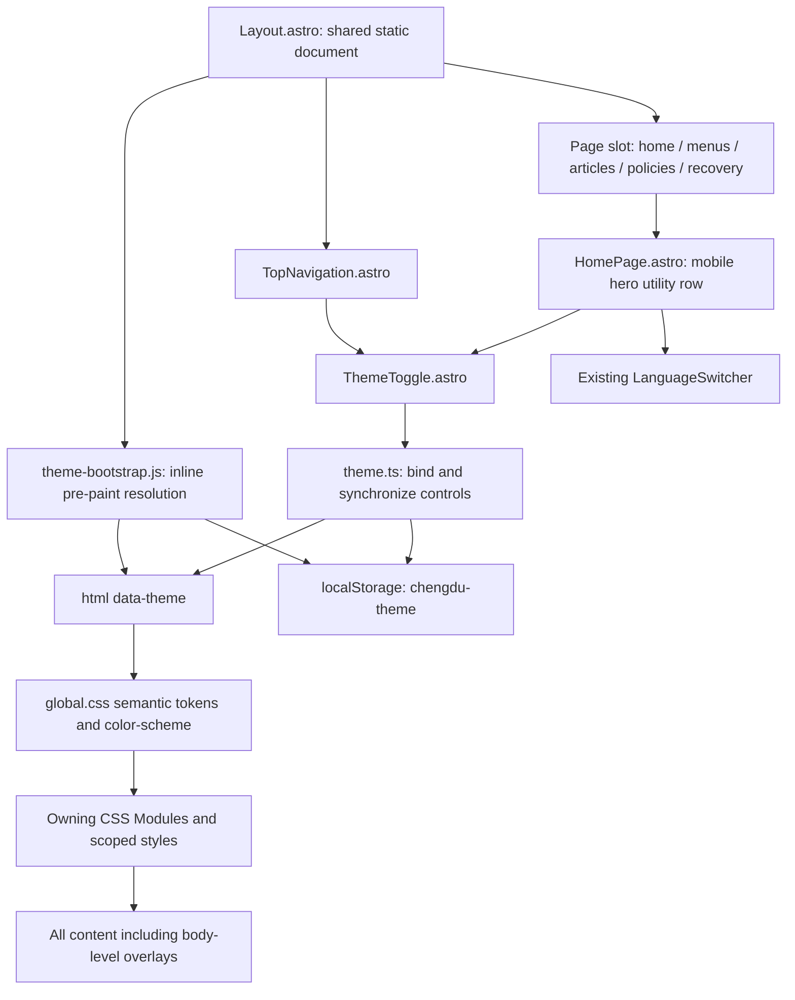
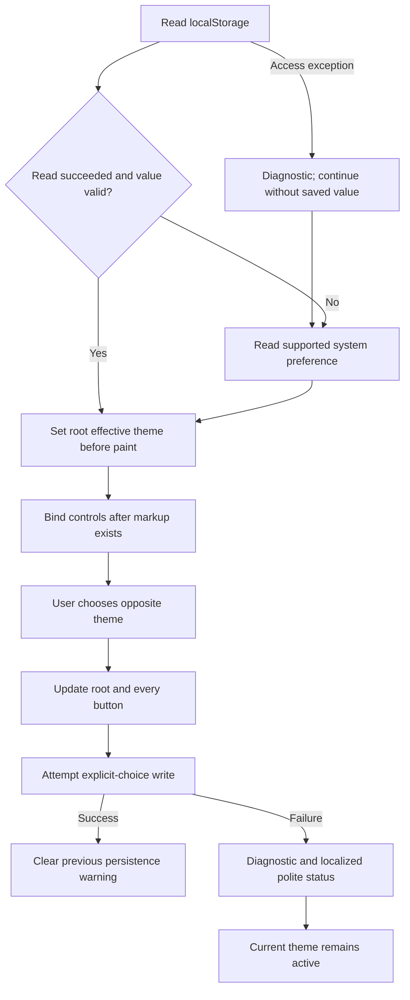

## Context

See `proposal.md` for motivation and `specs/site-theme/spec.md` for the behavior contract. Chengdu is a static Astro site with one shared `src/layouts/Layout.astro`, CSS Modules, Tailwind 4, native dialogs, and small browser enhancements. Theme handling must work on direct deep links rather than only after homepage initialization.

`global.css` currently hardcodes body/paragraph/heading ink. Component modules mix Tailwind light utilities and literal colors; menus and policy pages also contain scoped color rules. The mobile navigation overlay is moved into `document.body`, so a page-wrapper theme selector would miss it. Navigation is hidden at the mobile homepage's initial scroll position. The existing language control and its initial-access requirements must remain intact.

`PRODUCT.md` and `DESIGN.md` establish the incumbent food-led red/gold identity; this is an additional palette, not a redesign. Jest uses a Node environment, and `tools/check-static-artifacts.js` already inspects emitted HTML and runtime boundaries.

## Goals / Non-Goals

**Goals:** Resolve appearance before visible rendering, establish semantic color roles without changing geometry, and keep one document-level effective theme shared by every control and overlay.

**Non-Goals:** A theme provider/store, framework hydration, three-way Light/Dark/System selector, live system-preference listeners, cross-tab synchronization, account sync, new test framework, broad stylesheet cleanup, or rebranding. Third-party iframe internals are outside first-party styling control; their container and attribution still need appropriate contrast.

## Decisions

### 1. Document-level attribute with explicit-choice precedence

Use `document.documentElement.dataset.theme` with only `light` or `dark`. Store explicit choices under `chengdu-theme`; accept no other value. Resolve in this order: validated storage choice, system dark preference, light fallback. Do not persist a detected system default, so future page loads can follow a changed system preference until the visitor explicitly chooses.

Automatic adaptation is load-time only. The theme attribute is the current-page source of truth, not a separate state store. Reloads and same-origin language links restore the same saved choice. Cross-tab events and reset-to-system UI are deliberately outside this two-state request.

Alternative: a framework context or cookies adds hydration/server coupling to a static preference. A continuously monitored system preference adds behavior not requested and complicates manual precedence.

### 2. One small executable bootstrap, inlined before styles

Add `src/lib/theme-bootstrap.js` as a standalone, synchronous, browser-valid IIFE without imports/exports. Import its text using Astro/Vite `?raw` in `Layout.astro` and emit `<script is:inline set:html={themeBootstrap}>` immediately after the early charset/viewport metadata and before stylesheet links. Keep CSS imported by the layout; inspect built HTML to confirm Astro's generated stylesheet ordering still places the bootstrap first. Do not assume authored ordering proves emitted ordering.

This avoids a deferred/module-script light flash and an extra pre-paint network request. The bootstrap only validates/reads storage, checks `matchMedia` when necessary, and sets the attribute. Wrap only storage access in a narrow exception boundary; report access failure with a stable console diagnostic and continue to system resolution. Guard absent `matchMedia` explicitly. Unexpected programming errors are not swallowed.

`src/lib/theme.ts` handles explicit selection, persistence, and control synchronization after markup exists, reading the already-resolved attribute rather than resolving a second time. Both files use the documented key and accepted values; tests execute the actual raw bootstrap and check that this contract remains aligned. No executable user data is interpolated into the script.

Alternative: duplicate bootstrap logic in each page risks divergence; importing a bundled module runs too late. Serializing typed functions with `toString()` is fragile and unnecessary.

### 3. Semantic tokens cover surfaces, not global inversion

Define light role defaults in `global.css`, explicit dark overrides under `:root[data-theme="dark"]`, and a CSS-only `prefers-color-scheme: dark` fallback under `:root:not([data-theme])`. Explicit light must win over system dark. Set `color-scheme` to the effective mode for native controls. Media fallback and explicit-dark rules must share the same documented values, verified by review, without adding a CSS framework.

Candidate dark palette below is a starting point; final role pairs must satisfy the specification's measured contrast thresholds. Preserve existing light values per role instead of collapsing subtly different cream, gray, editorial, and brand colors.

| Semantic role | Light authority | Candidate dark value | Consumers |
| --- | --- | --- | --- |
| `--theme-canvas` | Existing white; separate menu canvas stays `#f8fafc` in light | `#171311` | Page and menu background |
| `--theme-surface` | Existing `#ffffff` | `#241d19` | Cards, drawers, dialog panels |
| `--theme-warm-surface` | Existing `#fff8ea` / distinct warm-paper variants | `#30231c` | Warm sections and notices |
| `--theme-text` | `#222222` | `#f4e8db` | Body and paragraph ink |
| `--theme-heading` | `#1a1a1a` | `#fff8ea` | Headings |
| `--theme-muted` | Existing gray or warm-muted role | `#cbb8ac` | Metadata and supporting text |
| `--theme-link` | Existing editorial/navigation role | `#ffb09b` | Links and editorial accents |
| `--theme-border` | Existing role-specific subtle borders | `#806a5d` | Meaningful control edges |
| `--theme-selected-surface` | `#dbeafe` | `#1b354d` | Menu current category |
| `--theme-selected-text` | `#1d4ed8` | `#b7dcff` | Menu current-category text |
| `--theme-focus` | Existing focus role | `#ffd700` | Visible focus |

Also define role-specific hover, placeholder, translucent-nav, recovery-overlay, warning/success/closed-calendar, and action-surface pairs where existing components need them. Existing solid red/gold CTAs and photo overlays can remain identical when their contrast is already adequate; do not change all reds to the text-link token.

Replace the affected color declarations locally in their owning CSS Modules or scoped styles. Keep layout/motion utilities. Pay attention to `@apply` colors, inline menu selected-state styles, and the high specificity of existing dialog rules. Avoid blanket `!important` overrides or broad Tailwind utility remapping.

Images, maps, video, and the already-dark hero are not inverted. Keep Google's dark-gray logo unmodified on a small fixed light attribution backing with its required clear space; surrounding review UI follows the theme. Do not filter provider logos or assume external iframe content can be recolored.

Alternative: CSS filters distort food photography and attribution. Dark overrides alone leave hardcoded light paragraph ink and nested overlays inconsistent.

### 4. Reusable native toggle with synchronized state

Add `ThemeToggle.astro`, with locale and placement props and compact scoped styling. Use a native button with a stable localized name such as "Dark theme" and `aria-pressed`; show a decorative sun in light mode and moon in dark mode, hidden from assistive technology. Do not change the button's accessible name to an opposite action while also using pressed semantics.

Render buttons hidden until the controller reads the effective root attribute, sets correct state, and attaches handlers. This prevents a wrong-state or dead button during loading/no-JavaScript use. A single shared initialization path binds all `[data-theme-toggle]` instances; after activation it updates the attribute, every button's state, and attempts persistence. Successful writes clear old failure status; failed writes keep the page theme, emit a diagnostic, and announce the localized "Theme changed, but could not be saved." through a shared polite status region. No reload, focus movement, or animation is needed.

Place one toggle beside language/mobile-menu controls in `TopNavigation.astro`; add another in a mobile hero utility row in `HomePage.astro`, alongside an instance of the existing `LanguageSwitcher`. This preserves initial mobile language access while navigation is hidden. Hide the hero utility row when desktop navigation is initially visible. Narrow navigation may shorten the visual brand while keeping its accessible identity; allow utility-row wrapping and account for actual header height in menu panes. Retain existing `showTopNavigation` behavior rather than introducing navigation on intentionally chrome-free pages.

Alternative: only placing the switch inside the mobile overlay or hidden header makes it undiscoverable on the first mobile screen. A third "System" control is not needed for the requested two-state interaction.

### Component Architecture

### Data Flow and Failure Boundaries

### Detailed Code Change Inventory

Paths are relative to `repos/chengdu`; edit only the affected color/interaction surfaces.

| File Path | Change Type | Change Description | Affected Module |
| --- | --- | --- | --- |
| `src/lib/theme-bootstrap.js` | Add | Browser-valid raw pre-paint resolver with narrow storage recovery | First paint |
| `src/lib/theme.ts` | Add | Typed explicit-choice handling, validation, button sync, persistence feedback | Browser theme controller |
| `src/components/ThemeToggle.astro` | Add | Localized native toggle markup and compact theme-aware styling | Shared control |
| `src/layouts/Layout.astro` | Modify | Inline bootstrap before emitted styles; shared persistence status region | Document shell |
| `src/styles/global.css` | Modify | Light/dark roles, no-JavaScript media fallback, native color scheme | Style foundation |
| `src/components/TopNavigation.astro`, `src/components/HomePage.astro` | Modify | Toggle placement; initially visible mobile hero language/theme row | Navigation/home |
| `src/components/{TopNavigation,DesktopNavigation,MobileNavigation,LanguageSwitcher}.module.css` | Modify | Tokenize chrome/dropdown/panel colors; fit controls and header geometry | Navigation |
| `src/pages/index.module.css`, `src/components/{IndexSection,RestaurantFeatures,GoogleReviews}.module.css` | Modify | Warm surfaces, section/card ink, review states and attribution backing | Homepage |
| `src/components/{Gallery,InteractiveImage,DishDetailDrawer}.module.css` | Modify as needed | Theme light panels and controls; preserve intentional photo overlays | Galleries/dialogs |
| `src/pages/{menu,menu-mobile}.module.css`, `src/components/MenuContent.astro` | Modify | Canvas/cards/placeholder/notice/category/search/dialog colors, including scoped rules | Menus |
| `src/components/{LocationSection,BusinessCalendar,FloatingActionButtons,Footer}.module.css` | Modify as needed | Panels, map backing, calendar state pairs, action bar; retain readable red footer | Shared content/chrome |
| `src/templates/{blog-list,blog-post}.module.css` | Modify | Cards, prose headings/links, notices, pagination, focus/hover states | Editorial |
| `src/pages/{privacy,terms}.astro`, `src/pages/[locale]/{privacy,terms}.astro` | Modify | Replace scoped editorial ink with readable theme roles | Policy pages |
| `src/pages/404.module.css` | Modify | Theme recovery overlay, card, description, and suggestion states | Recovery |
| `src/i18n/{en-US,es-MX,zh-CN,vi}.ts` | Modify | Stable toggle label and persistence-failure message | Localization |
| `src/lib/theme.test.ts` | Add | Run actual raw bootstrap in isolated Node VM; test controller through small DOM/storage fakes | Existing Jest |
| `tools/check-static-artifacts.js` | Modify | Confirm bootstrap presence/ordering, controls, and continued static runtime boundaries | Generated-output checks |
| `README.md`, `DESIGN.md`, `.impeccable/design.json` | Modify | Preference policy, token authority, dark/ light previews kept aligned | Documentation |

## Risks / Trade-offs

- [Stylesheet emission may precede the authored bootstrap] -> Inspect generated HTML and adjust layout placement until the executable bootstrap precedes style links; also check the first visible frame on a cold load.
- [Hidden or resized navigation loses initial control access] -> Add the mobile hero utility row and inspect desktop/mobile at 320px and 200% zoom with all enabled locale labels.
- [Stored choice is unavailable or rejected] -> Catch only storage operations, retain current-page interaction, and provide diagnostics plus localized write-failure feedback; do not claim future persistence.
- [Light-only rules survive token migration] -> Inventory owning modules/scoped rules and inspect normal, hover, focus, selected, dialog, and inserted-review states in both themes.
- [A dark palette damages attribution or food presentation] -> Preserve imagery and logo assets; retain a fixed-light provider-logo backing and measure surrounding contrast.
- [New shared bytes affect static delivery budgets] -> Keep the raw bootstrap tiny and the controller framework-free; compare representative home/menu/article initial transfers against existing documented baselines without waiving their requirements.
- [No JavaScript cannot read saved local storage] -> Explicitly document CSS system preference as the no-JavaScript fallback; hide inactive manual controls.

## Migration Plan

This is an additive static-site change with no server or content-data migration. Introduce tokens with unchanged light defaults, wire pre-paint resolution and controls, then migrate owning styles and validate output together. Existing visitors with no `chengdu-theme` key use system preference. Invalid keys are ignored rather than destructively clearing unrelated storage.

Rollback restores the previous styles/layout/control code; a leftover `chengdu-theme` value is inert in the old implementation. No deployment, permission, host, analytics, or ordering configuration changes are part of the implementation tasks.

## Validation Strategy

Use existing Jest with lightweight fakes and Node VM to exercise the shipped bootstrap, including both system modes, absent APIs, invalid values, read/write exceptions, and explicit-choice precedence. Cover synchronized duplicate controls, keyboard button semantics, and failure-message clearing.

Run the existing typecheck/build/static-artifact commands after implementation. Inspect generated HTML ordering on home, menu, article, policy, and recovery pages across enabled locales; preserve no-React, route-specific loading, and static content checks.

Perform one batched browser pass across desktop/mobile, light/dark, cold direct loads, navigation/reload, storage failures, keyboard interaction, no-JavaScript, reduced motion, narrow widths/zoom, opened overlays/dialogs, and article variants. Measure the specified contrast ratios and first visible frame rather than checking only final screenshots. Preserve existing light presentation and inspect the enabled-review path without introducing fake production reviews or new test dependencies.
