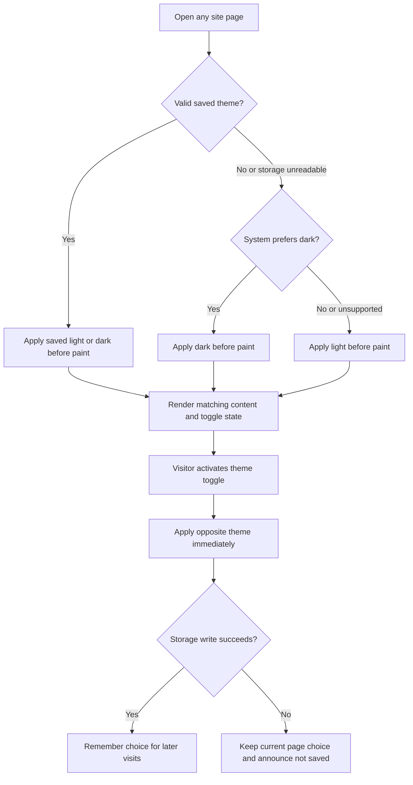

## Why

Chengdu currently presents light-only navigation, menus, and reading surfaces, even when a visitor prefers dark mode. A coordinated dark theme, automatic first-paint adaptation, and remembered manual choice will make visits comfortable without disrupting the existing light experience.

## What Changes

- Add semantic light/dark design tokens and apply them across shared chrome, homepage sections, both menu layouts, dialogs, articles, policy pages, and recovery pages.
- Provide a localized, keyboard-accessible light/dark toggle in desktop and mobile navigation, with an equivalent entry on the mobile homepage hero where navigation is initially hidden.
- Resolve the theme before first paint: a valid saved choice wins; otherwise use `prefers-color-scheme`, with light as the unsupported-browser fallback.
- Persist explicit user choices for later visits and same-origin language/page navigation. Keep switching usable when storage is unavailable and explain that the choice could not be saved.
- Keep static content, native interactions, ordering destinations, photography, the already-dark hero, and the red-and-gold identity intact. No new framework or dependency is required.

### Interaction Flow



### Interface Prototype

```text
Desktop navigation
+-----------------------------------------------------------------------+
| Chengdu | Home Menu Delivery Pickup Blogs Visit | Language | Dark [ON] |
+-----------------------------------------------------------------------+
| Existing food-led hero and ordering actions remain unchanged           |
+-----------------------------------------------------------------------+

Mobile homepage, before scrolling
+-----------------------------------+
| Language        Dark [ON]          |  Hero utility controls
| Chengdu                           |
| Big flavor. A little adventure.   |
| [Delivery] [Pickup] [View Menu]    |
+-----------------------------------+

Mobile shared navigation
+-----------------------------------+
| Chengdu | Language | Dark [ON] | = |
+-----------------------------------+
| Menu / article / existing content |
+-----------------------------------+
Dark [ON] is a button with aria-pressed="true"; activate to use light.
On a failed write: "Theme changed, but could not be saved."
```

## Capabilities

### New Capabilities

- `site-theme`: Coordinated dark/light presentation, pre-paint preference resolution, accessible manual switching, and persistent explicit preference.

### Modified Capabilities

- `astro-static-delivery`: Permit a bounded shared theme bootstrap and toggle enhancement in the client-runtime allowlist without whole-page hydration.

## Involved Repositories

| Repository Name | Path | Edit Permission | Purpose |
| --- | --- | --- | --- |
| Chengdu | repos/chengdu | [editable] | Current change context |

## Impact

All paths below are relative to `repos/chengdu`.

| File Path | Change Type | Change Reason | Impact Scope |
| --- | --- | --- | --- |
| `src/styles/global.css` | Modify | Define semantic theme tokens and document color scheme | All rendered pages |
| `src/lib/theme-bootstrap.js`, `src/lib/theme.ts`, `src/components/ThemeToggle.astro` | Add | Small pre-paint resolver and synchronized, accessible toggle | Theme initialization and browser interaction |
| `src/layouts/Layout.astro` | Modify | Run the resolver in the head before stylesheet links | Initial paint on every shared-layout route |
| `src/components/TopNavigation.astro`, `src/components/HomePage.astro` | Modify | Place reusable toggle in navigation and mobile hero | Desktop/mobile discovery |
| `src/components/*.module.css`, `src/pages/*.module.css`, `src/templates/*.module.css` | Modify affected styles | Replace light-only surfaces/inks with role-based tokens | Chrome, home, menus, gallery, calendar, recovery, and articles |
| `src/components/MenuContent.astro`, `src/pages/{privacy,terms}.astro`, `src/pages/[locale]/{privacy,terms}.astro` | Modify scoped styles | Theme remaining active-category, dialog, and policy-page colors | Menu overlays and policy reading |
| `src/i18n/{en-US,es-MX,zh-CN,vi}.ts` | Modify | Translate state labels and persistence feedback | Existing locale coverage |
| `src/lib/theme.test.ts`, `tools/check-static-artifacts.js` | Add/modify | Cover resolution, failure cases, and emitted bootstrap ordering | Existing Jest and static-artifact validation |
| `README.md`, `DESIGN.md`, `.impeccable/design.json` | Modify | Record preference policy, tokens, and matching component previews | Contributor and design context |

There are no backend/API, ordering-service, analytics, deployment, or content-authoring changes. Assumptions for this non-interactive run: use a two-state toggle; automatic resolution happens on page load, not continuously as system preferences change; automatic defaults are not persisted as explicit choices; storage is local to the browser and origin.
