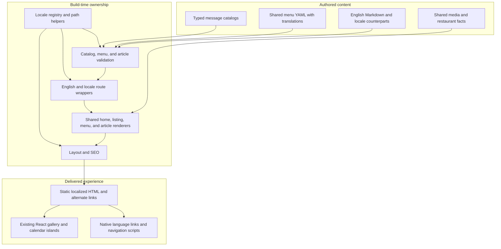
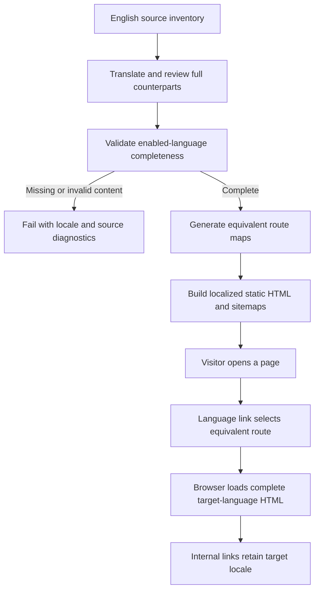

## Context

See `proposal.md` for motivation and the four capability deltas for behavior. The editable site is Astro 7 static output with React islands, CSS Modules, existing Jest tests, and a production origin of `https://www.chengdufoodtulsa.com`. Current content has 250 articles with stable English slugs, 21 listings, 15 menu categories, and 145 dishes. Source filenames include Chinese but article bodies are currently English. The content loader already scans `src/content/**/*.md`.

Language assumptions currently sit in `Layout.astro` (`lang="en"`), `SEO.astro`, hardcoded page/component text, `name_en` menu rendering, English date formatters, and business-hour messages. `MenuContent.astro` owns responsive menu switching and dialog text. `TopNavigation.astro` can hide on scroll, so merely inserting a control into the existing hidden header would not meet initial/mobile discoverability. `tools/check-static-artifacts.js` assumes 276 total HTML files and English titles from a captured Gatsby baseline; that checker must be extended, not its baseline rewritten to hide regressions.

## Goals / Non-Goals

**Goals:** Generate complete static equivalents through shared renderers; pass an explicit typed locale into Astro and React boundaries; retain the existing English route contract and interaction behavior; make missing translations actionable build failures.

**Non-Goals:** A runtime translation engine, remote translation calls, accounts, preference storage, geolocation, automatic language redirects, translated URL slugs, external-provider localization, a visual redesign, and changes to business-hour calculation or publication workflows.

## Decisions

### 1. URL locale is the only language state

Use a small typed registry in `src/lib/i18n.ts` for `en-US`, `es-MX`, `zh-CN`, and `vi`, plus the enabled-language list. English has no prefix; the others use their exact BCP 47 identifiers as URL prefixes. Validate route parameters against enabled locales; do not treat arbitrary first path segments as language codes. Final acceptance requires all four enabled.

Provide shared helpers for localized internal paths, removal of a recognized prefix, and equivalent-route generation. The route family, stable article slug, or listing number supplies page identity. Only page paths are localized: assets remain root-relative and external links remain unchanged.

| Page identity | `en-US` | `es-MX` example |
| --- | --- | --- |
| Home | `/` | `/es-MX/` |
| Desktop menu | `/menu/` | `/es-MX/menu/` |
| Mobile menu | `/menu-mobile/` | `/es-MX/menu-mobile/` |
| Blog root | `/blog/` redirects to `/blog/1/` | `/es-MX/blog/` redirects to `/es-MX/blog/1/` |
| Listing | `/blog/3/` | `/es-MX/blog/3/` |
| Article | `/blog/how-to-make-fuqi-feipian/` | `/es-MX/blog/how-to-make-fuqi-feipian/` |
| Explicit recovery page | `/404.html` | `/es-MX/404/` |

No `/en-US/` aliases are introduced. Static-host unknown routes still use the existing global English `404.html`; known localized recovery pages provide localized navigation but are not a promise of per-prefix host error handling. They are excluded from sitemaps and marked `noindex`; their switcher links use the equivalent recovery route rather than imply that the missing URL exists.

**Alternatives:** Prefixing English would disturb established links; language cookies would make static URLs ambiguous; automatic negotiation would override the requested English default. Native Astro static routing plus explicit helpers avoids a dependency or server middleware.

### 2. Share page bodies, not entire hydrated page trees

Keep existing English page files as thin wrappers passing `en-US`. Add `src/pages/[locale]/index.astro`, `menu.astro`, `menu-mobile.astro`, `blog/[page].astro`, `blog/[...slug].astro`, and `404.astro` with `getStaticPaths()` restricted to enabled non-English locales.

Extract the current homepage body to `HomePage.astro` and the current blog listing body to `BlogListing.astro`; both accept locale and route identity. Reuse existing `MenuContent.astro` and `BlogPost.astro` instead of duplicating each locale's markup. Pass locale through `Layout.astro` to navigation, footer, location, floating actions, SEO, and React islands. Gallery media and assets remain shared; only localized strings/data are passed to hydrated components, not all language catalogs.

Locale-aware menu redirects replace only the menu route-family segment and preserve locale, search, and fragment. Preserve the existing breakpoint, history behavior, category IDs, focus restoration, and non-JavaScript content.

**Alternatives:** Copying pages four times causes drift; whole-page React hydration undermines existing static delivery. Shared Astro renderers fit the existing codebase with minimal routing changes.

### 3. Typed local message catalogs cover visible and accessible text

Create `src/i18n/en-US.ts`, `es-MX.ts`, `zh-CN.ts`, and `vi.ts`. Use English keys to define a string-valued message shape, with exact key completeness for each catalog and runtime nonempty-value validation for enabled catalogs. Include long homepage and variant framing text, SEO copy, navigation toggle states, dialog labels, video/gallery playback and error messages, AI labels, empty states, footer, and not-found recovery text.

Prefer complete message templates with named interpolation over English sentence concatenation. Render linked sentences as localized segments around existing anchors without raw translated HTML or `set:html`. Formatting uses `Intl.DateTimeFormat`, `Intl.NumberFormat`, and `Intl.PluralRules` where applicable. Article dates keep UTC interpretation; business hours retain the existing visitor-local clock and minute refresh.

Keep `src/components/data.ts` scheduling helpers and existing default English outputs compatible; add locale-aware presentation of the existing next-opening calculation rather than changing its math. Localize time and duration display without changing stored `HH:mm` schedule values.

**Alternatives:** An internationalization package is unnecessary for four static catalogs; scattered string conditionals would lose completeness checks. Raw HTML catalogs complicate safety and interactive links.

### 4. Complete translated Markdown uses the existing slug as identity

Keep existing English files in `src/content/` to minimize migration; add explicit `locale: en-US` to their metadata. Put translated files in `src/content/es-MX/`, `src/content/zh-CN/`, and `src/content/vi/`, preserving corresponding basenames and slugs. Require explicit locale metadata and verify that source directory and locale agree. A translation pair is keyed by slug; do not introduce a second translation identifier.

Extend the collection schema and article helpers to validate `(locale, slug)` uniqueness, reserve numbered listing slugs per locale, and require the same slug set as English for each enabled language. Reject orphan translations and mismatched date/banner identity. Disabled supported-language drafts remain subject to field/schema validation but are not required to have complete coverage and are not emitted.

`getPublishedArticles(locale)` validates the inventory, filters by locale, then applies existing sort and pagination helpers. The two Sesame Chicken slugs remain disambiguated in every locale. English article content is not shortened or rewritten as part of localization.

Translate frontmatter text and the entire Markdown body. Update same-site links in translated Markdown to the target locale while preserving external URLs, asset paths, and factual content. Keep shared category anchors stable. For article heading fragments, prefer explicit shared IDs when an authored cross-language fragment must survive; otherwise language switching removes nonmatching fragments.

Automated checks reject empty bodies, wholesale copied English bodies, missing pairs, obvious placeholders, and missing required metadata. They do **not** prove linguistic quality or full semantic translation. A documented review of every translated article compares all source sections, lists, tables, quantities, cautions, links, and disclosures; no title-only, excerpt-only, or summary substitute is accepted. English changes require updates and renewed review across enabled counterparts. No automatic translator or external content upload is introduced.

**Alternatives:** Runtime translation cannot guarantee complete crawlable bodies; independent translated slugs complicate identity and backward compatibility; translating just template text fails the full-article requirement.

### 5. Preserve YAML source identity and add localized text only

Keep `name_en`, `name_zh`, `intro_en`, `intro_zh`, codes, images, emoji, and ordering intact. Add a `translations` mapping keyed by non-English locale on each group and item. Group entries contain `name` and `intro`; item entries contain `name`, and `description` and ordered feature names where English supplies those fields. Feature emoji continue to come from the shared source array. Existing Chinese names seed `zh-CN` review but do not imply complete Chinese descriptions.

Extend `parseMenus` validation to identify locale, YAML source, group prefix, dish code, and missing field. `loadMenus(locale)` produces a localized display model; retain default-English compatibility for existing callers. Preserve absence of optional English descriptions/features rather than invent new information; when present in English, require corresponding translations in every enabled locale. Secondary cultural Chinese labels remain optional and use `lang="zh-CN"`.

Localize `DishImages.ts` data through stable existing image filenames for featured/gallery content; avoid duplicate photographs or a second independently maintained menu inventory.

**Alternatives:** Four independent YAML copies duplicate nontext facts; changing source names in place risks English regression; retaining English descriptions on translated pages is an incomplete version.

### 6. Native language links with minimal enhancement

Implement `LanguageSwitcher.astro` using native `details`/`summary` and anchors rather than a custom combobox or auto-submitting select. Render native-language names with their own `lang` and `hreflang`, localized summary/accessibility text, visible focus, and an active-language indication. The current equivalent link uses `aria-current="page"`. A small script may close the disclosure on Escape and restore summary focus, but navigation must work without it.

Place the control in the shared header outside the mobile overlay. Adjust header visibility so language access is visible at initial load, including the homepage hero and mobile pages, and remains visible while the control has focus or is expanded. Preserve existing scroll behavior outside those conditions. Use existing style tokens, wrap expanded links, reserve enough layout clearance, and avoid overlap with the mobile toggle and floating ordering actions.

Static links preserve page identity without scripts. Enhance them to retain the current query string and only known shared fragments: category IDs and section IDs are shared; target article IDs can be supplied from rendered heading metadata using Astro's render result. Nonmatching hashes are dropped. Static full-page links retain language naturally without storing preferences.

**Alternatives:** Flags conflate countries with languages; a custom menu adds unnecessary keyboard complexity; putting the only switcher inside the closed mobile overlay harms discoverability.

### 7. Localized SEO and privacy rules use the same route model

Pass locale and an equivalent-page map into `SEO.astro`. Emit `<html lang>` with the exact locale, localized title suffix/description/keywords, self-canonical URL, reciprocal `hreflang` for enabled counterparts, `x-default` for English, and Open Graph locale values (`en_US`, `es_MX`, `zh_CN`, `vi_VN`) with alternate locales. Preserve absolute social images and the production origin.

Configure `astro.config.mjs` redirects for enabled localized blog roots, and extend sitemap generation using the same English/unprefixed locale mapping. Verify translation grouping for nested blog paths rather than assuming automatic sitemap locale detection is correct. Filter all localized recovery and redirect-only routes. Keep authored robots/manifest/icons unchanged.

Normalize only recognized locale prefixes before evaluating existing analytics path exclusions, so localization cannot bypass `/preview/` or `/do-not-track/me/too/` policy. Preserve opt-in initialization, DNT behavior, event names, and nonblocking ordering links.

**Alternatives:** Canonicalizing translated pages to English would suppress independent language discovery; including disabled-language alternates advertises nonexistent pages; matching exclusions against prefixed paths alone risks inconsistent privacy behavior.

### Component and module architecture

### Translation and routing data flow

### Detailed code change inventory

All paths are relative to `repos/chengdu`. New names are implementation targets; retain existing module responsibilities.

| File Path | Change Type | Change Description | Affected Module |
| --- | --- | --- | --- |
| `src/lib/i18n.ts`, `src/lib/i18n.test.ts` | Add | Locale registry, enabled list, path normalization, equivalent links, message interpolation validation | Locale core |
| `src/i18n/{en-US,es-MX,zh-CN,vi}.ts` | Add | Complete typed visitor-facing catalogs | Text presentation |
| `src/pages/{index,menu,menu-mobile}.astro`, `src/pages/blog/{[page],[...slug]}.astro` | Modify | English wrappers reuse shared renderers | Existing URLs |
| `src/pages/[locale]/{index,menu,menu-mobile,404}.astro`, `src/pages/[locale]/blog/{[page],[...slug]}.astro` | Add | Generate enabled non-English equivalents | Localized URLs |
| `src/components/HomePage.astro`, `src/components/BlogListing.astro` | Extract | Move current bodies without visual or behavioral duplication | Shared page rendering |
| `src/layouts/{Layout,BlogPost}.astro` | Modify | Explicit locale props, localized article framing and dates | Page composition |
| `src/components/SEO.astro`, `astro.config.mjs` | Modify | Language metadata, equivalent alternates, redirects, localized sitemap coverage | Crawlable outputs |
| `src/components/LanguageSwitcher.astro`, `src/components/LanguageSwitcher.module.css` | Add | Native disclosure and equivalent-page anchors | Language UI |
| `src/components/{TopNavigation.astro,TopNavigation.module.css,DesktopNavigation.module.css,MobileNavigation.module.css}` | Modify | Localized static/runtime labels and discoverable responsive switcher | Navigation |
| `src/components/{Footer,LocationSection,FloatingActions,RestaurantFeatures,BackgroundVideo}.astro` | Modify | Shared localized copy and error/control labels | Shared restaurant UI |
| `src/components/{DishImages.ts,MainGallery.tsx,GridGallery.tsx,InteractiveImage.tsx,IndexSection.tsx}` | Modify | Localized dish text, controls, dialog labels, and island props | Galleries and featured dishes |
| `src/components/{BusinessCalendar.tsx,data.ts}`, `src/components/data.test.ts` | Modify | Locale-specific dates, times, statuses, durations; retain math | Business-hour presentation |
| `menus/menu-*.yml`, `src/lib/{menu-data,menus}.ts`, `src/components/MenuContent.astro` | Modify | Typed translation mappings, complete localized models, responsive paths | Menu |
| `src/content.config.ts`, `src/lib/{content,articles}.ts` | Modify | Explicit locales, inventory validation, locale-scoped queries | Article publishing |
| `src/content/*.md`, `src/content/{es-MX,zh-CN,vi}/*.md` | Modify / add | Explicit English locale and 750 complete translated counterparts for current inventory | Authored articles |
| `src/pages/404.astro`, `src/pages/404.module.css`, `src/styles/global.css` | Modify as needed | Shared recovery rendering and language-safe wrapping/font fallbacks | Error and typography presentation |
| `src/lib/analytics-policy.ts`, `src/lib/analytics-policy.test.ts` | Modify | Preserve exclusions after recognized locale-prefix removal | Analytics privacy |
| `src/lib/{content,menu-data}.test.ts`, `src/components/BlogMotion.test.js`, `tools/check-static-artifacts.js` | Modify | Cover intentional extraction, language coverage, routes, and preserved behavior | Validation |
| `README.md`, `docs/how-to-post.md`, `PRODUCT.md`, `DESIGN.md`, `.impeccable/design.json` | Modify | Translation authoring/review contract and language-control design record | Documentation |

### Validation strategy

Extend the existing Jest runner for routing/prefix boundaries, equivalent links, catalog completeness, missing/orphan/duplicate translations, invalid directory metadata, menu text parity, locale date formatting, and unchanged business-hour boundaries. Update source-oriented motion tests for extracted renderer locations without weakening their checks.

Extend `tools/check-static-artifacts.js` to validate the preserved English route subset against the immutable Gatsby baseline and derive additional route counts from enabled locales/content inventory. Assert all 250 articles and 21 listing pages per locale, both menus' 145 dish identities, nonempty full-body output, localized framing/metadata, reciprocal alternate links, no broken root-relative references, sitemap coverage, exclusion of redirect/recovery routes, static assets, and absent Gatsby/page-wide runtime. Use authored locale fixtures for text expectations, not English warning strings on translated pages.

During implementation, run related Jest selectors together, then `npm run typecheck`, `npm run build`, and `node tools/check-static-artifacts.js` from `repos/chengdu`. Run the existing IndexNow dry-run if sitemap structure changes. Conduct a bounded browser inspection of all four locales at desktop and mobile widths, including 320px and 200% zoom, keyboard-only and no-JavaScript navigation, menu resize/query/hash preservation, article language switching, live labels, diacritics/CJK fallbacks, reduced motion, and existing ordering behavior. Review every translated body against English; automated counts cannot prove semantic completeness.

## Risks / Trade-offs

- [750 long article translations are substantial work] → Prioritize `es-MX`, track complete counterpart coverage, then finish `zh-CN` and `vi`; do not mark the four-language change complete early.
- [Metadata and structural checks cannot establish translation quality] → Require full section-by-section content review and regional-language review before enabling a locale.
- [Translations drift after English edits] → Document paired updates and review as the authoring contract; automated inventory validation catches omissions, not stale meaning.
- [Long Spanish/Vietnamese strings or missing CJK glyphs break layout] → Preserve token identity, add system font fallbacks, wrap labels, and inspect narrow/zoomed layouts.
- [Additional routes invalidate baseline checks] → Preserve English regression expectations while deriving multilingual inventory independently; do not recapture a permissive baseline.
- [Native disclosure and header scroll logic conflict] → Keep the switcher outside the mobile overlay and lock header visibility while focused/open.
- [Static hosts cannot negotiate localized 404 responses] → Keep the global English 404 and explicit localized recovery pages; preserve true unknown-route 404 behavior.

## Migration Plan

1. Establish locale helpers and the complete English catalog while preserving all current URLs and content.
2. Convert shared renderers and data access to explicit locale props, add validation, and keep non-English languages disabled until ready.
3. Complete and review all `es-MX` text and full articles, then enable it; repeat for `zh-CN` and `vi` in that order. Completion requires all three added languages enabled.
4. Update authoring/design documentation and run the validation strategy against the four-language static artifact before considering implementation finished.

This change does not alter delivery infrastructure. If a language must temporarily be disabled, remove it from the enabled list and regenerate routes, switcher choices, alternates, and sitemaps consistently; keep its authored content for correction. This is a temporary recovery measure, not satisfaction of final four-language scope. English URLs remain unchanged throughout.
