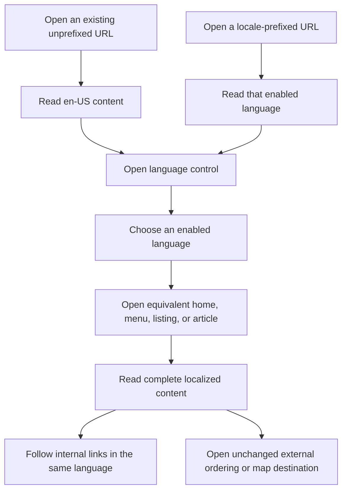

## Why

Chengdu's public site does not let visitors choose a reading language, limiting access for Tulsa's multilingual communities and public-sector and business audiences. American English must remain the authoritative, complete version, while Mexican Spanish offers the highest-priority expansion and Mandarin and Vietnamese complete the requested coverage.

## What Changes

- Support `en-US`, `es-MX`, `zh-CN`, and `vi` across the home page, both menus, blog listings and complete articles, shared components, accessibility labels, and metadata.
- Add an accessible language switcher that opens the equivalent page in the selected language and keeps internal navigation in that language.
- Keep American English as the default and preserve existing unprefixed URLs. Add locale-prefixed URLs for other languages without browser-language redirects.
- Fully translate every published article, including Markdown bodies, openings, dish labels, warnings, disclosures, and variant-specific conclusions; translated titles or excerpts alone are insufficient.
- Prioritize implementation in this order: `en-US`, `es-MX`, `zh-CN`, `vi`. Enable each additional language only after its entire content set is ready; completion of this change requires all four enabled.
- Emit locale-specific document language, canonical URLs, alternate-language links, social metadata, and sitemap entries. Fail builds on incomplete enabled-language content instead of silently substituting English.

### Planning assumptions

Continue the existing `add-multilingual-support` scaffold rather than creating a duplicate. The request for four languages defines the final scope; the lower priority of `zh-CN` and `vi` determines implementation order, not their omission. The URL is the language preference: no cookies, local-storage preference, automatic detection, translation service, or new backend is required. Restaurant branding, addresses, dish codes, business rules, media, and external ordering destinations remain unchanged. External services and developer documentation are outside the visitor-facing translation scope. Government and business information, where present, uses `en-US` as its authoritative source; do not invent new content for those audiences.

## Involved Repositories

| Repository Name | Path | Edit Permission | Purpose |
| --- | --- | --- | --- |
| Chengdu | repos/chengdu | [editable] | Current change context |

## Capabilities

### New Capabilities

- `multilingual-navigation`: Locale routing, language switching, locale-preserving navigation, language activation, and accessible controls.
- `localized-content`: Complete translated interface, menu, article, and metadata content with explicit English authority and translation completeness checks.

### Modified Capabilities

- `static-content-publishing`: Publish equivalent article and listing sets per enabled language, retain stable slugs and article variants, and emit language-aware crawlable metadata.
- `restaurant-site-experience`: Localize restaurant discovery, menus, dialogs, navigation, and business-hour presentation while preserving existing interactions.

## Impact

No new server, translation API, internationalization dependency, or publication workflow is planned. Static output and content-review work increase: the current 250 articles require 750 full translated counterparts; the 15 menu groups and 145 dishes need localized text. Existing tests and the static-artifact checker must distinguish preserved English behavior from intentional additional routes.

### Code change map

Paths below are relative to `repos/chengdu`; proposed new files are planning targets.

| File Path | Change Type | Change Reason | Impact Scope |
| --- | --- | --- | --- |
| `src/lib/i18n.ts`, `src/i18n/*.ts` | Add | Centralize locales, route helpers, and complete typed message catalogs | All visitor-facing pages |
| `src/pages/index.astro`, `src/pages/menu*.astro`, `src/pages/blog/*.astro`, `src/pages/[locale]/**` | Modify / add | Preserve English entry points and generate translated equivalents | Static routes |
| `src/components/HomePage.astro`, `src/components/BlogListing.astro`, `src/layouts/*.astro`, `src/components/SEO.astro` | Extract / modify | Share localized page rendering and language-specific metadata | Layouts and page composition |
| `src/components/LanguageSwitcher.astro`, `src/components/TopNavigation*.css`, `src/components/TopNavigation.astro` | Add / modify | Provide a visible, keyboard-accessible language control | Desktop and mobile navigation |
| `src/components/*`, `src/lib/menu-data.ts`, `src/lib/menus.ts`, `menus/menu-*.yml` | Modify | Translate menu, gallery, dialog, hours, notices, and ordering labels | Restaurant surfaces and islands |
| `src/content.config.ts`, `src/lib/content.ts`, `src/lib/articles.ts`, `src/content/**` | Modify / add | Group complete translations by locale and stable article slug | All published articles |
| `astro.config.mjs`, `src/pages/404.astro`, `src/pages/[locale]/404.astro` | Modify / add | Register localized redirects, metadata discovery, and recovery pages | Static host compatibility |
| `src/lib/*.test.ts`, `src/components/*.test.*`, `tools/check-static-artifacts.js` | Modify / add | Cover language switching, completeness, and localized generated HTML | Existing validation |
| `README.md`, `docs/how-to-post.md`, `PRODUCT.md`, `DESIGN.md`, `.impeccable/design.json` | Modify | Document locale authoring and the intentional language-control extension | Contributor and design context |

### Interaction flow



### ASCII interface prototype

```text
Desktop: shared navigation, visible on initial load
+-----------------------------------------------------------------------+
| Chengdu | Home | Menu | Delivery | Pickup | Blog | Visit | Language [v] |
+-----------------------------------------------------------------------+
                                                +----------------------+
                                                | English (US) [active]|
                                                | Spanish (Mexico)     |
                                                | Mandarin (Simplified)|
                                                | Vietnamese           |
                                                +----------------------+
| Article title, date, disclosures, and full translated body             |

Mobile: language control remains available outside the closed menu
+----------------------------------+
| Chengdu       Language [v]  [Menu]|
+----------------------------------+
| Expanded language links wrap     |
| with full labels and focus cues. |
+----------------------------------+
| Current page in selected language|
+----------------------------------+
```

The sketch uses English descriptions for planning only; production choices use native language names, not flags. Preserve the existing red-and-gold identity, readable article layout, menu drawer semantics, and reduced-motion behavior.
