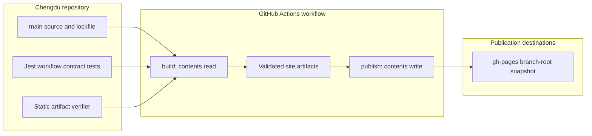

## Context

See `proposal.md` for motivation and `specs/github-pages-publication/spec.md` for the behavior contract.

Chengdu builds an Astro static site into `dist/` with `npm ci` and Node.js 22. Its workflows use checkout/setup-node v5, and PR validation runs Jest, type checking, builds, and `tools/check-static-artifacts.js`. Canonicals, sitemap URLs, and root-relative site links assume `https://www.chengdufoodtulsa.com`. Remove the Azure Static Web Apps publishing workflow while retaining authored host configuration.

The read-only reference workflow separates build and branch publication using an artifact and `peaceiris/actions-gh-pages@v4`. Its payload contains provider configuration and nested `dist/`, and it warms external hosting domains. Those details are unsuitable for this branch-only publication workflow.

## Goals / Non-Goals

**Goals:** Use one validated build for branch publication; isolate write permissions; preserve the existing production URL contract; provide testable workflow configuration; remove Azure publishing automation.

**Non-Goals:** Create a GitHub Pages deployment, configure Pages settings, change DNS, introduce project-subpath routing, modify site UI/content, add hosting-provider files or warmup scripts, or modify the reference project.

## Decisions

### 1. Two jobs with explicit artifact and permission boundaries

Use `build` and `publish` jobs in `.github/workflows/site-deploy-gh-pages.yml`. Set workflow-wide `contents: read`; only `publish` receives `contents: write`. Use built-in `GITHUB_TOKEN`, checkout v5, setup-node v5, and Node.js 22. Checkout credentials need not persist.

The build installs with `npm ci`, runs the workflow contract tests with the existing Jest runner, runs `npm run typecheck`, builds with `PUBLIC_ENABLE_ANALYTICS=true`, and executes `node tools/check-static-artifacts.js`. It then removes Azure's `staticwebapp.config.json` from the generated output and writes `CNAME` containing `www.chengdufoodtulsa.com` and an empty `.nojekyll` into `dist/`.

Upload the prepared directory as `chengdu-gh-pages-payload` with `actions/upload-artifact@v4`. Scope upload to `dist/`, include hidden files to preserve `.nojekyll`, and fail on missing files. Only successful build completion unblocks publication.

**Alternative:** A single job is shorter but combines build and destination privileges. Rebuilding during publication breaks the validated-artifact guarantee.

### 2. Root-level branch snapshot only

The `publish` job downloads the named branch artifact into a dedicated directory, verifies required root files, and uses `peaceiris/actions-gh-pages@v4` with `publish_branch: gh-pages`, that directory as `publish_dir`, `enable_jekyll: false`, and `cname: www.chengdufoodtulsa.com`. Keep clean replacement and branch history. There is no Pages artifact, deployment job, or Pages permission. Whether Pages is configured to consume `gh-pages` is an operator choice and outside this workflow.

Publishing the branch does not itself create or guarantee a Pages deployment. No live URL or deployment success is reported by this workflow.

### 3. Main-only, serialized production runs

Declare `push.branches: [main]` and `workflow_dispatch`. Gate `build` with `github.ref == 'refs/heads/main'`; downstream jobs require its success, so manual dispatch on another ref cannot publish. Do not add pull-request triggers to the publication workflow.

Use a fixed workflow-specific concurrency group with `cancel-in-progress: false` and bounded job timeouts. This prevents overlapping branch writes without interrupting an active publication. GitHub may replace an older pending run and does not guarantee FIFO ordering; this is not an every-commit deployment queue.

**Alternative:** Canceling active runs can interrupt a branch update. A branch-specific concurrency key could permit overlapping writes to the same production destination.

### 4. Preserve production-domain assumptions

Do not change `astro.config.mjs`, canonical generation, root-relative links, or analytics implementation. The published snapshot retains the existing production custom domain. README instructions explain branch permissions, DNS responsibilities, and the lack of live deployment guarantees.

`CNAME` alone neither changes DNS nor configures Pages. A project-subpath URL such as `/<repository>/` is not supported by this change.

**Alternative:** Adding a new base path would require application-wide link/asset changes and conflict with the existing production URL contract.

### 5. Reuse existing validation tools

Add a JavaScript Jest test in `tools/github-pages-workflow.test.js`, using the existing `yaml` dependency to parse workflow YAML rather than matching raw text. Assert allowed triggers, main-ref gating, concurrency, permission boundaries, validation-before-upload ordering, artifact paths/names, hidden-file inclusion, branch cleanup defaults, job dependency, and absence of Pages deployment and Azure publishing workflows.

Extend the existing PR workflow's path filters for the new workflow and test file. Its existing Jest invocation discovers the test automatically. Do not add a testing dependency or require a new workflow linter.

**Alternative:** Text-only assertions are brittle; a separate testing framework duplicates the existing runner.

### Code Change Inventory

| File Path | Change Type | Change Description | Affected Module |
| --- | --- | --- | --- |
| `repos/chengdu/.github/workflows/site-deploy-gh-pages.yml` | Add | Main-only triggers, concurrency, validated build, branch artifact and isolated branch publication | CI/publication |
| `repos/chengdu/.github/workflows/release.yml` | Delete | Remove Azure Static Web Apps publishing automation | CI/publication |
| `repos/chengdu/tools/github-pages-workflow.test.js` | Add | Parse YAML and assert the publication configuration contract with existing Jest/YAML dependencies | Workflow regression coverage |
| `repos/chengdu/.github/workflows/test.yml` | Modify | Add workflow/test path filters while retaining existing validation steps | PR CI |
| `repos/chengdu/README.md` | Modify | Describe branch snapshot, removed Azure workflow, domain scope, and recovery | Operations documentation |

### Architecture and Data Flow

## Risks / Trade-offs

- [Branch protection blocks publication] -> Document the required token access and let the job fail visibly; do not add privileged fallback credentials.
- [Existing custom domain still routes elsewhere] -> Keep DNS unchanged; the workflow only prepares and publishes a branch snapshot.
- [Pending runs can be replaced and ordering is not FIFO] -> Document serialized latest-pending behavior without promising publication of every commit.
- [Repository artifact upload exceeds GitHub's artifact limits] -> Let the artifact upload fail visibly rather than publishing incomplete content.

## Migration Plan

Implement the workflow, remove the Azure publishing workflow, add contract tests, update PR path filters and documentation. Validate locally with the existing Jest runner, type checking, a production build, and the static artifact verifier. Inspect required payload files; do not perform a live Pages deployment.

The first authorized run can create `gh-pages`. If the operator wants Pages to serve it, Pages source/settings and DNS must be configured separately; branch publication alone is not proof of a live deployment.

To restore an earlier branch snapshot, use a reviewed source revert on `main` followed by the normal validated publication path. DNS changes remain an operator responsibility.
