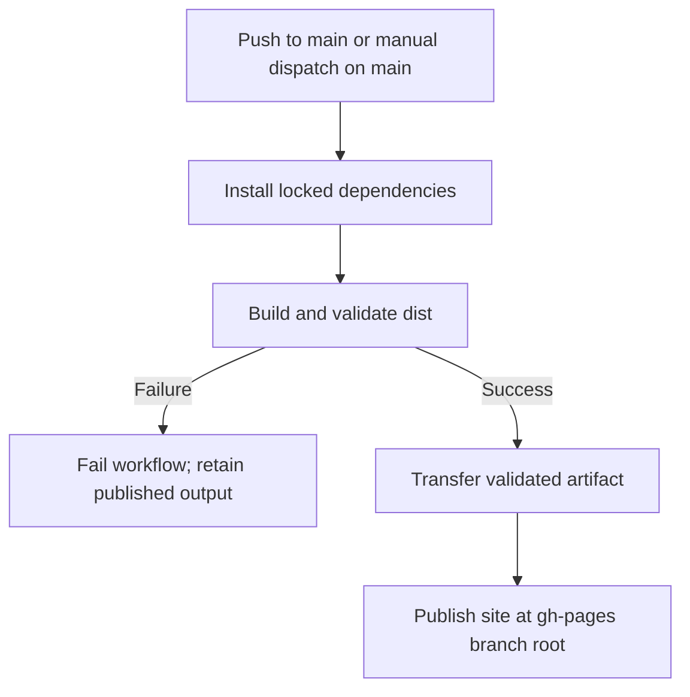

## Why

Chengdu has an Azure publishing workflow but no automated `gh-pages` publication. Add a reproducible workflow that validates and publishes the static output to `gh-pages`, without creating a GitHub Pages deployment, and remove the Azure publishing workflow.

## What Changes

- Add a workflow triggered by pushes to `main` and manual dispatch on `main`, with serialized publication and least-privilege job permissions.
- Build and validate the Astro site once, transfer its immutable artifact, and publish its contents at the `gh-pages` branch root.
- Do not upload a Pages artifact or create a GitHub Pages deployment.
- Remove the Azure publishing workflow without changing authored Azure configuration or DNS.
- Document branch publication, the production custom-domain assumption, and failure behavior.
- Add workflow contract coverage to the existing Jest-based CI.

## Involved Repositories

| Repository Name | Path | Edit Permission | Purpose |
| --- | --- | --- | --- |
| Chengdu | repos/chengdu | [editable] | Current change context |

## Capabilities

### New Capabilities

- `github-pages-publication`: Validated, automated publication of Chengdu's static output to the `gh-pages` branch, including triggers, permissions, artifact layout, failure handling, and operator documentation.

### Modified Capabilities

None. Existing static-site requirements remain unchanged.

## Impact

### Code Change Map

| File Path | Change Type | Change Reason | Impact Scope |
| --- | --- | --- | --- |
| `repos/chengdu/.github/workflows/site-deploy-gh-pages.yml` | Add | Build, validate, transfer, and publish the static output | Chengdu GitHub Actions |
| `repos/chengdu/.github/workflows/release.yml` | Delete | Remove Azure Static Web Apps publishing from GitHub Actions | Chengdu GitHub Actions |
| `repos/chengdu/.github/workflows/test.yml` | Modify | Include workflow changes and tests in PR validation triggers | Existing CI |
| `repos/chengdu/tools/github-pages-workflow.test.js` | Add | Assert workflow triggers, permissions, dependencies, and publication layout | Existing Jest runner |
| `repos/chengdu/README.md` | Modify | Explain branch publication, removed Azure workflow, and limitations | Contributor/operator documentation |

### Publication Flow

### Scope and Assumptions

Continue the existing change in non-interactive mode. Workflow paths are relative to the Chengdu repository root, not the enclosing planning repository. Use the existing Node.js 22 toolchain, lockfile, production origin `https://www.chengdufoodtulsa.com`, and analytics flag. There are no UI changes or new runtime dependencies.

The read-only implementation reference is `/home/newbe36524/repos/hagi/hagicode-mono/repos/site/.github/workflows/site-deploy-gh-pages.yml`; no reference files will be modified. Remove only Chengdu's Azure publishing GitHub Action; leave authored Azure configuration, application routes, framework configuration, and DNS unchanged. This workflow does not configure Pages or perform a Pages deployment.
