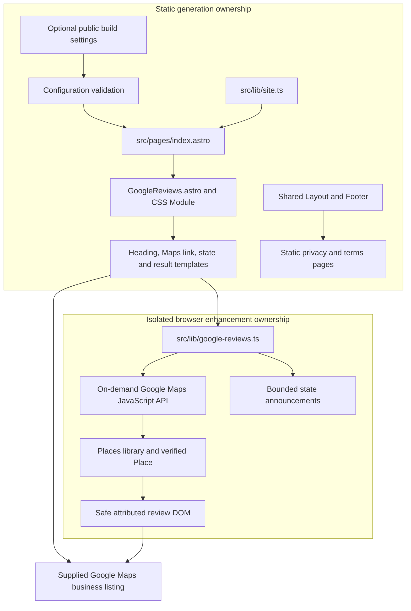
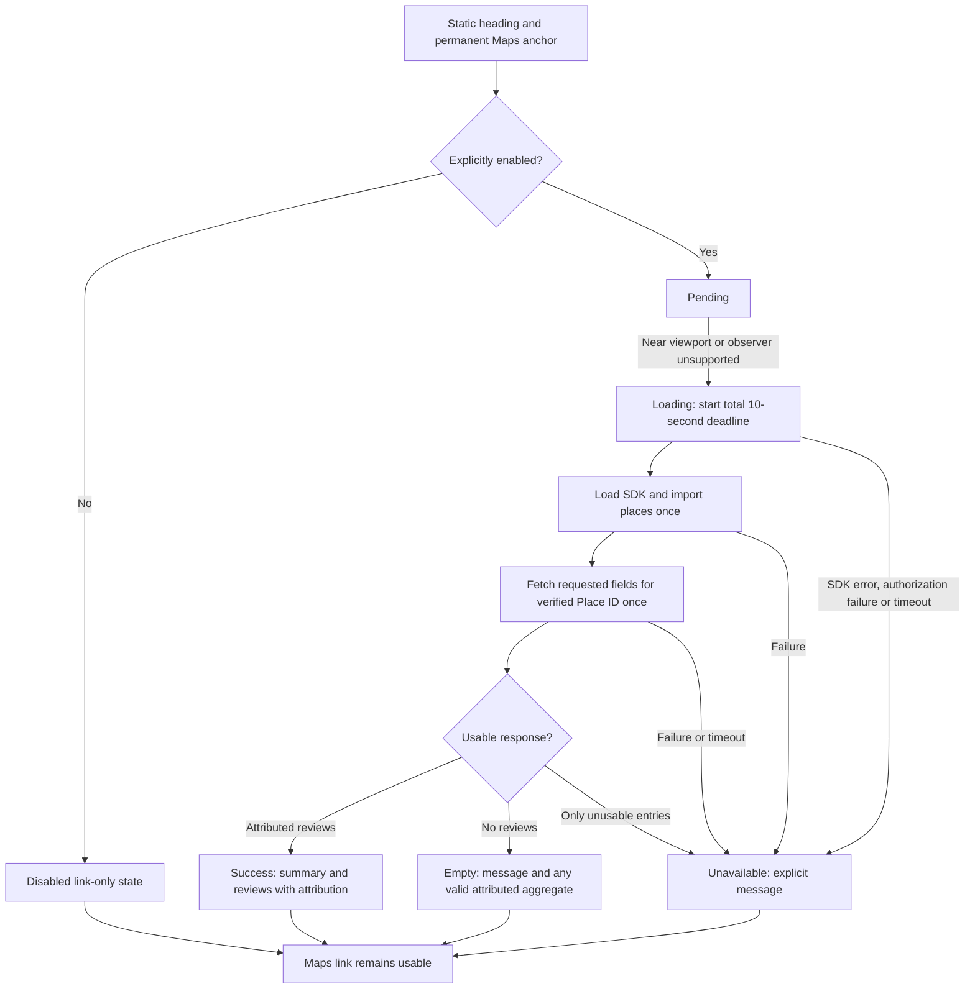

## Context

See `proposal.md` for motivation and scope. The current application is a statically generated Astro site with React islands, CSS Modules, Node.js 22, and Jest. `src/pages/index.astro` owns the homepage content; `Layout.astro` appends location and footer outside its slot. Reviews belong inside the homepage slot between `#your-table` and `#about`, not in the shared layout.

`PRODUCT.md` and `DESIGN.md` establish the existing food-led red-and-gold identity, 72rem section containers, readable serif text, reduced-motion behavior, and a prohibition on invented reviews. No existing review service, Maps JavaScript loader, privacy page, or terms page was found. The existing location iframe is not an SDK loader and does not guarantee an embeddable reviews presentation.

The separate multilingual proposal is pending, not a source of implemented locale helpers. This design uses the current English page and keeps review-interface strings together for a later localization change.

## Goals / Non-Goals

**Goals:** isolate third-party behavior behind a static Astro component; retrieve real reviews during the visitor session; keep loading bounded and source attribution visible; preserve offline static generation and existing interaction boundaries.

**Non-Goals:** a backend proxy, persistent review snapshot/cache, Google Maps scraping, a paid widget vendor, review submission, sentiment curation, carousels, polling, AI summaries, review-derived SEO structured data, a redesign, or implementation of the separate multilingual change.

## Decisions

### 1. Use the official browser Places interface, not a build-time snapshot

Load the Maps JavaScript API on demand and call `google.maps.importLibrary("places")`, construct a `Place` with the verified ID, then call `fetchFields` for `displayName`, `formattedAddress`, `rating`, `userRatingCount`, and `reviews`. Preserve required automatically returned place attributions. Name/address support identifying the returned business, not replacing authored location content.

The API returns up to five reviews; render valid attributed entries in returned order, including lower ratings. State "A selection returned by Google; not all reviews." Never label the set "latest" or calculate the business aggregate from it.

Alternatives: the existing Maps iframe cannot guarantee a standalone reviews block; a vendor widget adds cost and another dependency; a web-service proxy adds hosting and credential management; static snapshots introduce freshness and storage-policy obligations. Browser Places fits existing static hosting without creating a service.

### 2. Explicitly enable complete configuration; verify the business outside code

| Build Setting | Contract |
| --- | --- |
| `PUBLIC_ENABLE_GOOGLE_REVIEWS` | Only the literal `true` enables live loading; otherwise emit the static link-only state |
| `PUBLIC_GOOGLE_MAPS_API_KEY` | Required nonblank restricted browser key when enabled; intentionally public |
| `PUBLIC_GOOGLE_PLACE_ID` | Required nonblank verified API Place ID when enabled; not a Maps CID |

Validate enabled configuration in Astro frontmatter through a side-effect-free helper; errors identify setting names, not values. When disabled, do not serialize unused key/ID values into the section. Update `src/env.d.ts` for explicit types.

Add `site.googleReviewsUrl` containing the supplied business-listing URL exactly:

```text
https://www.google.com/maps/place/CHENGDU/@36.0666909,-95.889785,1197m/data=!3m1!1e3!4m8!3m7!1s0x87b68dd8115485d9:0x2d036ab8dd0fed52!8m2!3d36.0666866!4d-95.8872047!9m1!1b1!16s%2Fg%2F11t4y72z2b?entry=ttu&g_ep=EgoyMDI2MDkzMC4wIKXMDSoASAFQAw%3D%3D
```

Keep `site.mapUrl` unchanged because existing navigation and recovery contracts depend on it. Before enabling live content, an operator must verify the API Place ID against the intended CHENGDU business, address, and supplied listing using Google's Place ID tooling. Do not invent a Place ID or perform a billed search on every page visit.

Document the need for billing, Maps JavaScript API and Places API (New), API restrictions to those services, HTTP-referrer restrictions for approved production origins, quota controls and monitoring. Use a separate restricted development key for approved local preview origins. A browser key is not a server secret.

Wire these three settings into the existing workflow's build step using the corresponding repository variables (`vars.PUBLIC_ENABLE_GOOGLE_REVIEWS`, `vars.PUBLIC_GOOGLE_MAPS_API_KEY`, `vars.PUBLIC_GOOGLE_PLACE_ID`). This is source-level build configuration only; do not change publication permissions, triggers, branch logic, or analytics behavior. Unset variables produce the disabled state.

Alternative: enabling solely by key presence makes accidental activation possible and incomplete configuration too easy to overlook. A separate explicit flag provides a reliable off switch without a new configuration service.

### 3. Use one Astro component and one small, typed browser module

`GoogleReviews.astro` renders the heading, section container, Maps anchor, initial status, result container and templates for review markup. A processed component script initializes only a matching section; no React island or whole-page hydration is necessary. Keep behavior, SDK loading, validation and safe mapping in `src/lib/google-reviews.ts`, with no browser side effects on import so frontmatter and Jest can use its pure helpers.

Use the documented asynchronous script/callback loading mechanism rather than adding a widget or loader package. Create a single memoized SDK promise per page, use the official SDK URL with `loading=async`, `v=quarterly`, `language=en`, `region=US`, and `auth_referrer_policy=origin`, then import only `places`. Declare the callback/global types explicitly. Handle script errors and SDK authorization failure through the section's error boundary. Add `@types/google.maps` as a development dependency for official SDK types; do not manually invent a broad API type or add casts to `any`.

No generic provider interface, data store, service endpoint, or reusable carousel is introduced. The Maps iframe remains independent.

### Component architecture



### 4. Load near the viewport once, with one total deadline

Observe the section with `rootMargin: "200px 0px"`; on intersection, unobserve before starting the request. Without `IntersectionObserver`, initiate once after browser initialization. The enabled server-rendered status explains pending loading; a `<noscript>` message directs visitors to the Maps link. Disabled configuration never registers an observer or requests the SDK.

Start a 10-second total deadline when loading begins, covering both SDK loading and `fetchFields`. A fulfilled response becomes success or empty; script failures, rejected details requests, authorization failures and deadline expiry become unavailable. Catch only at this asynchronous integration boundary to surface the failure, not to return pretend review data. Sanitize diagnostics to an error category: never log a key, SDK URL or response body.

Use a settled guard to ignore late completions and prevent a timed-out attempt from replacing the terminal state. Promise races do not cancel Google's underlying operation and a timed-out billable request may still complete; the guard protects UI consistency, not billing. Clear timers and disconnect observers during cleanup. Do not poll, automatically retry, or add an in-section retry flow; recovery is the permanent Maps anchor or a page reload.



The deadline wins once; transitions out of any terminal state are disallowed. Other homepage content and ordering links never await this state machine.

### 5. Preserve content truth and render through safe DOM APIs

Map the official typed response to fields actually rendered. Valid ratings are finite numbers between 1 and 5; rating counts are nonnegative integers. Display a summary count independently when available, omitting absent fields rather than synthesizing zero or estimating totals.

Use `textContent` and DOM node creation for author names, business identity, review text and dates. Treat markup-looking review text as literal text. Validate external author/provider URLs with `URL` and allow only `https:`; omit unsafe optional links with a sanitized diagnostic, retaining the author name. Use `target="_blank"` and `rel="noopener noreferrer"` consistently.

A review requires nonblank returned author attribution and meaningful returned text or a valid rating. Rating-only entries say "Rating only"; missing dates/profile links are omitted. Do not fabricate "Anonymous" authors. If some entries are unusable, render the usable entries and log an omission category; if a nonempty response contains no usable entries, show unavailable instead of falsely reporting no reviews.

Format valid `publishTime` values as absolute `en-US` dates in UTC to avoid stale relative-time labels and local date shifts. Preserve the full returned text and language; do not translate, rewrite or summarize it. Long text can use a native `details` control with a "Read full review" summary and the complete text, not a JavaScript modal or an additional data fetch.

### 6. Include the complete attribution and public policy surfaces

Download an official Google Maps attribution SVG from Google's published attribution assets to `public/google-maps-logo.svg`, recording its source and leaving it unmodified. Keep it in the same container as API-derived aggregate and reviews, including the empty state when aggregate data is shown. Provide `alt="Google Maps"`, an approximately 18 CSS-pixel height, required clear space and sufficient contrast.

Render required place-provider attribution using official typed attribution fields and safe text/links; no raw attribution or review HTML is inserted with `innerHTML`. Check installed definitions against the current API documentation when implementing. Keep author names beside reviews, with valid returned profile links. Author photos are omitted to avoid extra requests and image-failure handling; author names remain required and profile links remain available.

Add static `/privacy/` and `/terms/` pages using the existing layout without reviews or location loading. The privacy page must explain that configured review loading contacts Google, that Google may receive browser/network information, that the application does not persist review content, and that analytics remain independently opt-in; link to `https://policies.google.com/privacy`. The terms page must incorporate applicable Google Maps terms by reference and link to `https://maps.google.com/help/terms_maps/`. Link both pages from the footer. Do not assert that no other third parties exist: the site already uses fonts, an embedded map and optionally analytics. Final policy text requires operator review before live enablement.

Update the generated-artifact checker explicitly: preserve the immutable Gatsby baseline, add exactly `/privacy/` and `/terms/` to intentional route/sitemap expectations, and retain every original route/content assertion. The current expected HTML count is 276; this change adds two routes, yielding 278 before any separate locale change. Check footer links, policy bodies, Maps fallback, review placement, attribution asset and absence of embedded review snapshots.

### 7. Extend, rather than replace, the incumbent visual system

Visitor mode is **Persuade**: provide credible evidence before About and location without distracting from ordering. Reuse `IndexSection.module.css` for the section/container; keep warm paper, editorial red, Playfair Display headings and Merriweather body text. Review-source attribution is visually separated from restaurant-authored copy and never repainted as a restaurant endorsement.

Use a one-column grid below 640px, two columns from 640px and three from 1024px, with remaining reviews wrapping. All cards use `min-width: 0`, text wraps (including long names/unbroken content), and external-link targets are at least 2.75rem high. Keep full text reachable and avoid fixed-height clipping. Use numeric rating text alongside any decorative stars hidden from assistive technology.

Provide one polite status region and `aria-busy` only during loading; do not turn the entire results container into an announcement flood. Do not move focus on loading or success. Keep visible red focus outlines, adequate text contrast and no new entrance/autoplay motion. A modest reserved status/result area reduces layout movement without leaving a blank multi-card skeleton in the off/error state. Preserve floating-action clearance already supplied by the homepage.

Record the intentional section extension in `DESIGN.md` and `.impeccable/design.json` together. Do not change product claims, fonts, unrelated sections, image disclosures or navigation.

### Detailed code change inventory

Paths below are relative to `repos/chengdu`.

| File Path | Change Type | Change Description | Affected Module |
| --- | --- | --- | --- |
| `src/pages/index.astro` | Modify | Import/compose the reviews component between `#your-table` and `#about`; leave reveal/hero behavior intact | Homepage composition |
| `src/components/GoogleReviews.astro` | Add | Validate public config; render static heading/link/status/templates; initialize scoped enhancement | Review section |
| `src/components/GoogleReviews.module.css` | Add | Responsive grid, wrapped content, rating/attribution styles and focus states | Review presentation |
| `src/lib/google-reviews.ts` | Add | Pure config validation, one SDK promise, one request, deadline/state handling, typed field validation and safe DOM rendering | Provider boundary |
| `src/lib/google-reviews.test.ts` | Add | Jest coverage of configuration, loading lifecycle, returned fields, unsafe content and fallbacks | Review behavior |
| `src/lib/site.ts`, `src/env.d.ts` | Modify | New review-listing destination and three public setting types; preserve existing destinations | Build/browser configuration |
| `public/google-maps-logo.svg` | Add | Official unmodified attribution asset | Provider branding |
| `src/pages/privacy.astro`, `src/pages/terms.astro` | Add | Static truthful integration policies and Google policy references | Policy routes |
| `src/components/Footer.astro` | Modify | Add public terms/privacy links without removing existing links | Shared discovery |
| `package.json`, `package-lock.json` | Modify | Add locked `@types/google.maps` development types only | Type safety |
| `.github/workflows/site-deploy-gh-pages.yml` | Modify | Pass three optional repository variables to production build only | Existing build step |
| `tools/github-pages-workflow.test.js` | Modify | Assert optional settings are supplied without changing permissions or analytics | Workflow contract |
| `tools/check-static-artifacts.js` | Modify | Add two routes/sitemap entries; verify policies, homepage placement, static fallback and official asset | Static output contract |
| `README.md` | Modify | Document configuration, identity verification, restricted browser keys, billing, loading/failure semantics and policy review | Operator/contributor guidance |
| `DESIGN.md`, `.impeccable/design.json` | Modify | Keep design snapshot and sidecar aligned with the new section | Design authority |

## Risks / Trade-offs

- [Missing credentials or verified Place ID] -> Implement and validate the disabled state and mocked provider behavior; explicitly record that genuine live acceptance remains blocked until authorized configuration is available.
- [Billing and quota exhaustion] -> Opt-in loading, near-viewport activation, one request per page, minimal field selection, restricted keys and operator-set limits. Budget alerts alone are not a hard spending cap.
- [Wrong business configured] -> Require identity verification before enablement; display returned identity without replacing the authored address; never derive a Place ID from the supplied feature identifiers.
- [Provider availability or delayed replies] -> One total deadline, terminal-state guard, explicit error text and permanent Maps recovery link; core content stays static.
- [A small Google-selected set is not representative of all customers] -> Disclose selection limits, preserve provider order and all valid returned sentiments, and link to the full business listing.
- [Storage/attribution/policy requirements change] -> No application persistence, official attribution assets, complete provider attribution and policy review against current official documentation before enablement.
- [Additional routes break strict baseline checks] -> Add explicit expected deltas for the two policy pages; do not weaken or rewrite the historical baseline.
- [Third-party SDK adds bytes after visibility] -> Request only Places when needed; do not preconnect/preload specifically for reviews or add a map solely to show reviews.
- [Pending multilingual work overlaps homepage/footer/checker paths] -> Base this change on currently implemented English paths; rebase the composition and explicit route assertions if locale work lands first rather than implementing speculative locale helpers.

## Migration Plan

There is no data migration. Introduce the section, policies and optional build configuration with live loading off by default. Validate disabled and enabled-with-mocked-provider builds without fetching review data during generation.

Live enablement is an external prerequisite, not an automated task in this change: the operator verifies the Place ID, configures a properly restricted key with billing/quota controls, reviews public policy text and provides the three build settings. An authorized preview then confirms real attribution and business identity. Until those inputs are available, report the live portion as blocked rather than representing fixture-based checks as live acceptance.

Rollback is configuration-only: set `PUBLIC_ENABLE_GOOGLE_REVIEWS` to `false` for the next static build. The useful Maps link and public policies remain; no stored review data needs removal. No hosting architecture, publication permission or ordering destination changes are needed.

## References

- [Official place reviews example and author attribution](https://developers.google.com/maps/documentation/javascript/place-reviews)
- [Maps JavaScript API loading strategies](https://developers.google.com/maps/documentation/javascript/load-maps-js-api)
- [Maps JavaScript policies, attribution and storage restrictions](https://developers.google.com/maps/documentation/javascript/policies)
- [Place ID verification and lifecycle](https://developers.google.com/maps/documentation/places/web-service/place-id)
- [API key restrictions](https://developers.google.com/maps/api-security-best-practices)

The design uses the official documentation inspected during planning. Billing tiers, enabled-project configuration and legal acceptance must be confirmed for the operator's Google Maps Platform account; none is inferred from the Maps listing.
