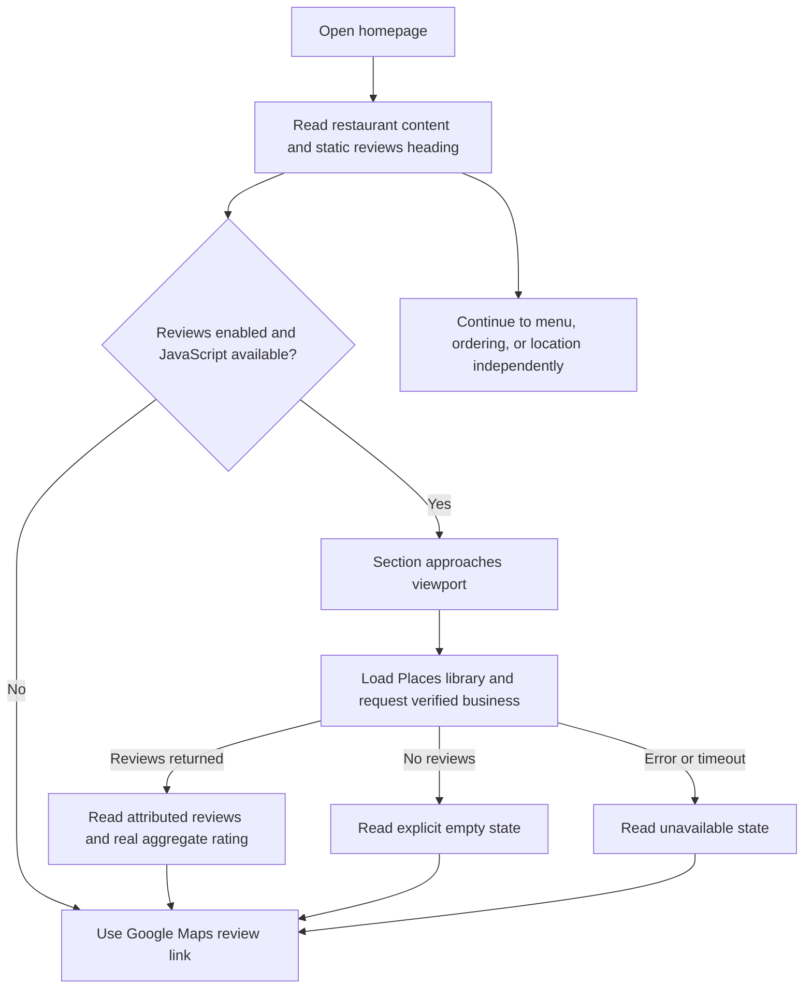

## Why

Chengdu's homepage currently offers no third-party customer feedback to help prospective diners assess the restaurant. Showing authentic Google reviews alongside the existing restaurant story can strengthen trust without interrupting menu browsing, ordering, or planning a visit.

## What Changes

- Add a Google reviews section after the dining-options section and before About, preserving the relative order of all existing sections.
- Retrieve the restaurant's aggregate rating, rating count, and up to five Google-selected reviews through the Maps JavaScript API's Places library when the section approaches the viewport.
- Display review text, author attribution, individual ratings, available publication dates, and required Google Maps/data-provider attribution in the existing warm red-and-gold visual system.
- Always render a direct link to the supplied Google business listing, including without JavaScript, without API configuration, and during empty/error states.
- Keep the integration explicitly opt-in at build time; document restricted browser-key configuration, billing prerequisites, and verification of the correct Place ID.
- Add publicly accessible terms and privacy pages and links required for Google Maps Platform use. Do not scrape, fabricate, archive, or persist Google review content.

### Planning assumptions

Continue the existing `chengdu-homepage-google-reviews` scaffold. Implementation targets the current English homepage and static Astro hosting; the separate `add-multilingual-support` change is not assumed to be implemented. Interface strings should remain easy to localize later, while third-party review content stays as returned by Google.

No working Google API key, verified API Place ID, or existing public policy pages were found in the inspected source. The supplied Maps URL identifies the intended business but its hexadecimal feature identifier is not an API Place ID. Live review enablement requires those external prerequisites; absent configuration must never produce invented reviews or ratings. Policy text must accurately describe this integration and must not claim unconfirmed restaurant-wide legal or privacy practices.

## Involved Repositories

| Repository Name | Path | Edit Permission | Purpose |
| --- | --- | --- | --- |
| Chengdu | repos/chengdu | [editable] | Current change context |

## Capabilities

### New Capabilities

- `google-review-display`: Authentic, attributed Google review retrieval and responsive homepage presentation with explicit configuration, bounded loading, and truthful fallbacks.

### Modified Capabilities

- `restaurant-site-experience`: Include the new reviews section while preserving existing homepage content, section order, and ordering/navigation behavior.
- `astro-static-delivery`: Permit an isolated browser-only reviews enhancement without page-wide hydration or a persistent server.

## Impact

The production integration adds a billable third-party browser request only when enabled and near the reviews section. The browser API key is intentionally public and must have HTTP-referrer and API restrictions; no server credential belongs in source or output. Builds remain offline with respect to Places, and review data is never bundled into static artifacts. Existing analytics opt-in remains independent.

### Code change map

Paths are relative to `repos/chengdu`; new paths are proposed implementation targets.

| File Path | Change Type | Change Reason | Impact Scope |
| --- | --- | --- | --- |
| `src/pages/index.astro` | Modify | Compose reviews between dining options and About | Homepage only |
| `src/components/GoogleReviews.astro`, `src/components/GoogleReviews.module.css` | Add | Semantic section, static fallback, responsive review presentation | Homepage UI |
| `src/lib/google-reviews.ts`, `src/lib/google-reviews.test.ts` | Add | Configuration validation, on-demand SDK/data loading, safe rendering and state coverage | Isolated browser enhancement |
| `src/lib/site.ts`, `src/env.d.ts` | Modify | Centralize the supplied review-listing URL and type public build configuration | Shared configuration |
| `src/pages/privacy.astro`, `src/pages/terms.astro`, `src/components/Footer.astro` | Add / modify | Provide discoverable policy disclosures and Google policy references | Public policy surfaces |
| `public/google-maps-logo.svg` | Add | Store the official, unmodified Google Maps attribution asset | Review-source attribution |
| `package.json`, `package-lock.json` | Modify | Add Google Maps TypeScript definitions only; no reviews-widget runtime dependency | Development types |
| `.github/workflows/site-deploy-gh-pages.yml`, `tools/github-pages-workflow.test.js` | Modify | Pass optional review build settings through the existing production build | Build configuration contract |
| `tools/check-static-artifacts.js` | Modify | Verify section/fallback/policies and account explicitly for two additional routes | Generated artifact compatibility |
| `README.md` | Modify | Explain setup, provider constraints, billing, fallback behavior and policy review | Contributor guidance |
| `DESIGN.md`, `.impeccable/design.json` | Modify | Record the intentional reviews-section extension together | Existing design context |

### Interaction flow



### ASCII interface prototype

```text
DESKTOP: after "Make room for Chengdu.", before About
+-----------------------------------------------------------------------+
| FROM OUR GUESTS                                                       |
| Google reviews                     [Read more on Google Maps ->]       |
| [rating]/5 from [count] Google ratings  (only after a valid response)   |
| A selection returned by Google; not all reviews.                       |
| +--------------------+ +--------------------+ +--------------------+  |
| | Author profile link| | Author profile link| | Author profile link|  |
| | [rating]/5  [date]  | | [rating]/5  [date]  | | [rating]/5  [date]  |  |
| | Actual review text | | Actual review text | | Actual review text |  |
| | [Full text, if long]| |                    | |                    |  |
| +--------------------+ +--------------------+ +--------------------+  |
| Further returned reviews wrap; no carousel or autoplay.                |
| [Official Google Maps attribution] [Required provider attributions]    |
+-----------------------------------------------------------------------+

MOBILE: same content and order, one review per row
+------------------------------------+
| Google reviews                     |
| [rating]/5 from [count] ratings     |
| [Read more on Google Maps ->]       |
| +--------------------------------+ |
| | Author / rating / available date| |
| | Actual review text              | |
| | [Full text, if long]            | |
| +--------------------------------+ |
| Remaining reviews stack vertically |
| [Official Google Maps attribution] |
+------------------------------------+

STATE AREA (in place of cards; Maps link always remains):
Pending: "Reviews load as you reach this section."
Loading: "Loading Google reviews..."
Empty:   "No reviews are available to display here."
Error:   "Google reviews are temporarily unavailable."
Off:     "Read guest reviews on Google Maps."
```

Bracketed values are placeholders for planning, never production sample claims. Reuse the 72rem container, fluid gutters, editorial heading/body typography, warm paper and red accents. Rating text must be readable without decorative stars; attribution uses Google's official unmodified assets rather than brand-styled lettering.
