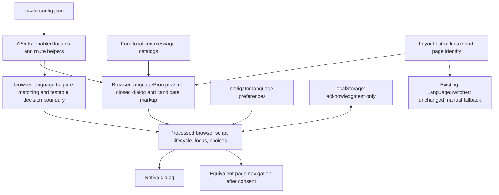
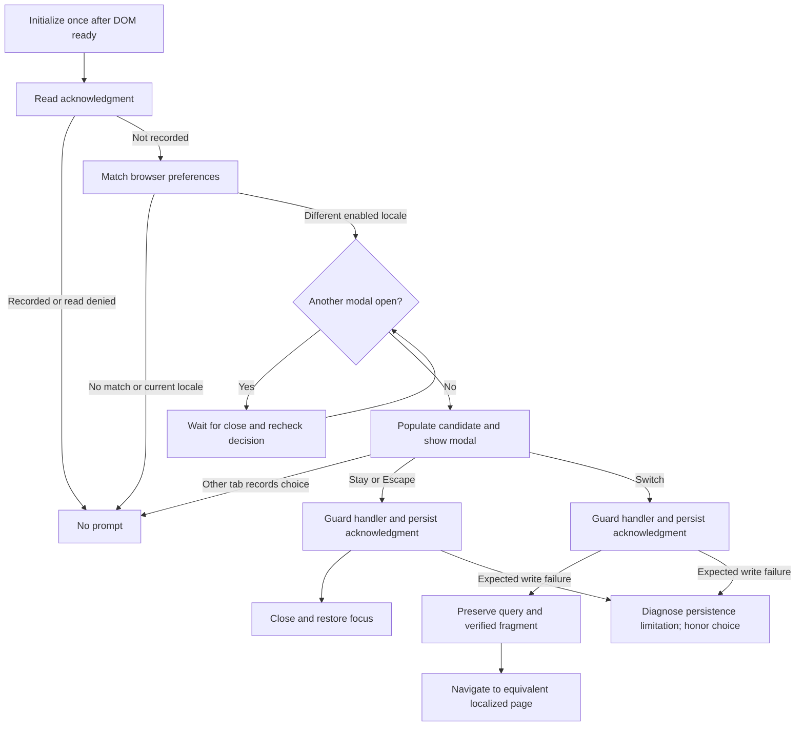

## Context

See `proposal.md` for motivation and `specs/browser-language-suggestion/spec.md` for behavior. Chengdu is statically generated Astro with native browser enhancements and no React runtime. `src/lib/locale-config.json` enables `en-US`, `es-MX`, `zh-CN`, and `vi`. `src/lib/i18n.ts` already provides equivalent-page paths and URL-state preservation. `Layout.astro` receives `locale` and `pageIdentity` and wraps localized content. The language switcher is a separate, no-JavaScript-capable control.

Existing `multilingual-navigation` explicitly forbids automatic redirects; consent-based navigation does not alter that requirement. `PRODUCT.md` and `README.md` currently describe no browser-language redirect and must distinguish automatic redirects from this optional suggestion. The incumbent UI uses warm paper, red accents, CSS Modules, and native dialogs. Jest runs in a Node environment.

## Goals / Non-Goals

**Goals:** Add a small client-only enhancement, keep enabled locales authoritative, separate pure matching from browser effects, persist decisions before navigation, and preserve content identity.

**Non-Goals:** Server-side negotiation, automatic redirection, storing a preferred locale for future automatic routing, cookies, analytics events, external language services, new UI frameworks, redesigning the language switcher, and repairing its existing fragment logic.

## Decisions

### 1. One shared native dialog with bounded initialization

Mount `BrowserLanguagePrompt.astro` once near the end of `Layout.astro`, passing the current locale and page identity. Emit a closed native `dialog` and pre-render localized copy and equivalent destinations for enabled candidate locales; browser code reveals only the selected candidate. This avoids shipping whole message catalogs for client interpolation and keeps the no-JavaScript state invisible.

Initialize through Astro's processed script after the DOM is ready. Read `navigator.languages`, falling back to `[navigator.language]` only when the list is absent or empty. Use an initialization/decision guard so duplicated initialization cannot show or record twice. Do not introduce a client router or hydration framework.

Use `showModal()` for focus containment and top-layer rendering. Focus stay first, handle `cancel` as refusal, and funnel every decision through one guarded handler. No separate close icon or backdrop dismissal is needed. Restore the previous connected focus target after staying or Escape. If another native modal is open at initialization, defer until it closes and recheck eligibility; do not stack dialogs. Navigation overlays must remain inert while the native modal owns focus.

Alternative: `window.confirm` is smaller but cannot meet controlled localization, native-name markup, layout, and accessible styling needs. A custom overlay duplicates modal focus behavior unnecessarily.

### 2. Explicit, conservative locale matching

Place pure matching in `src/lib/browser-language.ts`; import `enabledLocales` and `localeRegistry`, not a second supported-language list. Accept a supplied enabled list in the pure matcher for disabled-locale coverage. Normalize valid BCP 47 tags with platform locale parsing, handling malformed-tag `RangeError` narrowly.

For each preference in order, try an exact enabled locale first, then compatibility:

| Preference | Enabled target | Policy |
|------------|----------------|--------|
| English variants (`en`, `en-GB`, etc.) | `en-US` | Same language; site's sole English variant |
| Spanish variants (`es`, `es-ES`, etc.) | `es-MX` | Offer the site's available Spanish variant, labeled accurately |
| Vietnamese variants (`vi`, `vi-VN`, etc.) | `vi` | Same language |
| `zh`, explicit `Hans`, script-unspecified `zh-CN` / `zh-SG` | `zh-CN` | Compatible Simplified Chinese |
| Explicit `Hant`, script-unspecified `zh-TW` / `zh-HK` / `zh-MO`, other unrecognized Chinese variants | None | Do not assume script compatibility |

Explicit script takes precedence over region: `zh-Hant-CN` does not match, whereas `zh-Hans-TW` does. Skip unsupported or disabled targets. After selecting the first supported match, compare it to the document locale; do not continue to a secondary preference just to produce a prompt.

Alternative: exact-only matching misses common `vi-VN` and generic language settings; broad Chinese base-language matching incorrectly offers Simplified Chinese to Traditional Chinese readers.

### 3. A single persistent acknowledgment, not a stored language preference

Use origin-wide localStorage key `chengdu.browser-language-prompt.decided.v1` with value `"1"` for any completed choice. Only this value represents a recorded decision. Do not store browser language lists, timestamps, or a target locale. Merely opening a prompt does not write the marker; no-match/current-match loads do not consume the future opportunity.

Read storage before showing and again before any deferred display. Catch only expected browser storage `DOMException` failures at the storage boundary; emit `console.warn` with a feature-specific diagnostic and suppress the optional prompt on read failure. Unexpected programming errors propagate.

On an explicit choice, set the page-local handled guard, attempt to persist, then close or navigate. Expected write failure emits a diagnostic explaining that future visits might prompt again; immediate consent is still respected. Listen for this key's storage event while the dialog is open: a decision in another tab closes the prompt without navigation. No polling, retry loop, or sessionStorage fallback is necessary.

Alternative: marking on display prevents the visitor from deciding after accidental reload; storing a chosen locale risks introducing prohibited automatic routing. No storage mechanism can promise persistence when browser storage is denied or cleared.

### 4. Equivalent destination and conservative fragment preservation

Use `localizedPagePathname(pageIdentity, targetLocale)` to pre-render destinations, including recovery routes. At acceptance, call `preserveUrlState` with the live URL. Preserve queries verbatim. For fragments, verify stable IDs from shared layout/menu markup that are guaranteed to render in both locale versions, and only retain them when the current page contains that ID. Derive category IDs from shared menu structure rather than hard-code individual categories.

Translated article heading slugs are not equivalent merely because an ID exists on the current page. Drop unverified heading fragments; do not copy the language switcher's current-page-only inference. Treat malformed fragment encoding as unverified through a narrow `URIError` boundary. No destination fetch, network-dependent consent, or new global anchor manifest is needed.

Keep existing menu breakpoint navigation unchanged; acceptance uses the current equivalent menu route and its established resize behavior.

Alternative: always preserving hashes can navigate to missing translated anchors; fetching destination HTML adds latency and error states to a simple decision.

### 5. Restrained, localized interaction in the incumbent visual system

Visitor mode is Operate: understand the suggestion and decide, not engage with a promotional surface. Use existing readable typography, warm paper, dark text, red action accents, visible focus outlines, and a modest backdrop. Localize `language.prompt.*` title, body, stay, switch, and switcher reminder in all four catalogs with identical interpolation placeholders. Use text nodes rather than HTML interpolation and mark native names with their locale.

Use a fluid maximum width with viewport gutters, scrollable content constrained by viewport height, wrapping labels, minimum 2.75rem action heights, and stacked actions when necessary. No entrance animation is required; avoid adding motion to a first-load interruption. Update the design record and its sidecar together when implementation introduces the dialog.

Alternative: a toast is less interruptive but does not satisfy the requested decision popup; a visually loud modal distracts from dining/menu tasks.

### Component Architecture

### State and Data Flow

### Detailed Code Change Inventory

Paths are relative to `repos/chengdu`; new paths are proposed implementation locations, not existing files.

| File Path | Change Type | Change Description | Affected Module |
|-----------|-------------|-------------------|-----------------|
| `src/layouts/Layout.astro` | Modify | Mount exactly one prompt using existing locale and page identity | Shared shell |
| `src/components/BrowserLanguagePrompt.astro` | Add | Closed modal, server-rendered candidate copy/URLs, initialization, focus, storage and choice wiring | Browser enhancement |
| `src/components/BrowserLanguagePrompt.module.css` | Add | Incumbent palette, responsive wrapping, backdrop, focus and scrolling | Prompt presentation |
| `src/lib/browser-language.ts` | Add | Pure ordered matcher and minimal testable storage/decision boundary, without import-time browser globals | Language suggestion policy |
| `src/lib/browser-language.test.ts` | Add | Preference matrix, disabled targets, guards, injected storage failures and persistence ordering | Existing Node Jest runner |
| `src/lib/i18n.ts`, `src/lib/locale-config.json` | Reuse | Existing authoritative registry and URL helpers; no duplicate locale list or new language activation | Localization |
| `src/i18n/en-US.ts`, `es-MX.ts`, `zh-CN.ts`, `vi.ts` | Modify | Complete matching prompt keys and placeholders | Localized UI |
| `src/lib/i18n.test.ts` | Extend | Prompt-catalog completeness and representative equivalent-page URL-state coverage | Localization tests |
| `README.md`, `PRODUCT.md` | Modify | Document consent-only navigation, matching and browser-local one-time behavior | Product/maintainer context |
| `DESIGN.md`, `.impeccable/design.json` | Modify | Document prompt styling and interaction using existing tokens | Design context |

### Validation Approach

Use the existing Jest runner for pure logic and injected storage/decision boundaries: `npm test -- --runInBand src/lib/browser-language.test.ts src/lib/i18n.test.ts`. Keep browser API use out of import-time code so Node tests need no new DOM dependency. Follow with existing `npm run typecheck` and `npm run build`; inspect static output to confirm the dialog is closed, document language and canonical URLs are unchanged, and no unsupported routes are added.

Browser acceptance covers fresh storage, accepted/refused/Escape choices, subsequent reloads and routes, multiple tabs, unavailable storage, no JavaScript, translated deep links, existing modal interaction, equivalent menu routes, query preservation, verified versus translated fragments, focus restoration, 320px width, and 200% zoom. Use existing preview/browser tooling where available; do not add a test framework just for the popup.

## Risks / Trade-offs

- [Storage denied, cleared, or separate profiles/origins] -> Diagnose failures and document that cross-visit suppression applies only while the origin's marker persists.
- [Regional fallback may not reflect a visitor's preferred dialect] -> Name the actual offered locale accurately and require consent; never infer Chinese script indiscriminately.
- [Current page language may not be understood] -> Display native target-language names prominently and preserve the manual switcher; keep prompt copy consistent with existing page-language accessibility requirements.
- [Competing menu/gallery dialogs] -> Defer until existing native modals close and recheck the marker before display.
- [Translated anchors differ] -> Retain only verified shared IDs, dropping unverified fragments without fetching another page.
- [First-load interruption] -> No motion, stay initially focused, easy Escape refusal, and persistent acknowledgment.

## Migration Plan

No data or route migration is needed; existing visitors have no marker and become eligible after the enhancement is included. The implementation adds static dialog markup and one bounded client script, leaving existing URLs and manual switching intact. Disabling the component mount removes the behavior without invalidating content. Retain the versioned acknowledgment key across routine copy or style updates so visitors are not prompted again.
