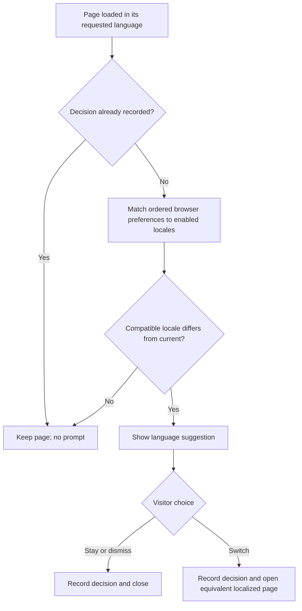

## Why

Visitors whose browser language is supported currently have to discover the language switcher themselves. A one-time, consent-based suggestion makes the appropriate translation easier to find without changing the language of a page before the visitor agrees.

## What Changes

- Detect browser language preferences after page load and suggest the highest-priority enabled, compatible locale only when it differs from the current page.
- Add an accessible language suggestion dialog with explicit switch and stay actions. Dismissal also means stay.
- Remember either decision in browser-local storage so subsequent visits do not show another suggestion.
- Reuse the enabled-language registry and equivalent-page routing; preserve the current content and query parameters when switching.
- Keep unsupported preferences, matching current languages, static HTML, and no-JavaScript navigation unchanged. Never redirect without consent.

## Capabilities

### New Capabilities
- `browser-language-suggestion`: Browser preference matching, accessible consent, equivalent-page navigation, and persistent one-time decisions.

### Modified Capabilities

None. Existing `multilingual-navigation` prohibits automatic redirects, not visitor-approved navigation; its routing and language-switcher requirements remain unchanged.

## Involved Repositories

| Repository Name | Path | Edit Permission | Purpose |
| --- | --- | --- | --- |
| Chengdu | repos/chengdu | [editable] | Current change context |

## Impact

All proposed application paths below are relative to `repos/chengdu`. No backend, dependency, translation-content inventory, SEO route, analytics, or deployment changes are needed.

| File Path | Change Type | Change Reason | Impact Scope |
|-----------|-------------|---------------|--------------|
| `src/layouts/Layout.astro` | Modify | Mount the suggestion once in the shared shell | All localized pages |
| `src/components/BrowserLanguagePrompt.astro` and `.module.css` | Add | Accessible native dialog and bounded browser enhancement | First eligible visit |
| `src/lib/browser-language.ts` and `.test.ts` | Add | Preference matching and decision-state behavior | Client-only suggestion |
| `src/lib/locale-config.json`, `src/lib/i18n.ts` | Reuse; extend only if needed | Keep enabled languages and paths authoritative | Locale eligibility and destinations |
| `src/i18n/{en-US,es-MX,zh-CN,vi}.ts` | Modify | Complete localized dialog and accessible labels | Four message catalogs |
| `src/lib/i18n.test.ts` | Extend | Validate catalog completeness and routing reuse | Existing Jest coverage |
| `README.md`, `PRODUCT.md`, `DESIGN.md`, `.impeccable/design.json` | Update where relevant | Explain consent, persistence limits, and new dialog | Maintainer context |

### Interaction Flow



### Interface Prototype

```text
+--------------------------------------------------+
| Read this page in {languageName}?                 |
| Your browser prefers {languageName}.              |
| You can change languages later using Language.    |
|                                                  |
| [Stay in {currentLanguage}] [Switch to {language}] |
+--------------------------------------------------+
```

Copy is localized in the current page language; language names use the registry's native labels. Preserve the incumbent warm paper/red visual language, visible focus, and equally reachable choices. Buttons stack at narrow widths.

### Non-Interactive Assumptions

Continue the existing scaffold rather than create a duplicate change. Run the suggestion on every shared-layout page, including translated deep links, but never suggest a lower-priority preference after the best match already equals the page language. Treat Escape as refusal; no separate close icon is necessary. Persistence is per browser origin/profile and lasts until storage is cleared; storage failures cannot guarantee cross-visit suppression and must be diagnosed explicitly. Matching and fragment rules are detailed in the design.
