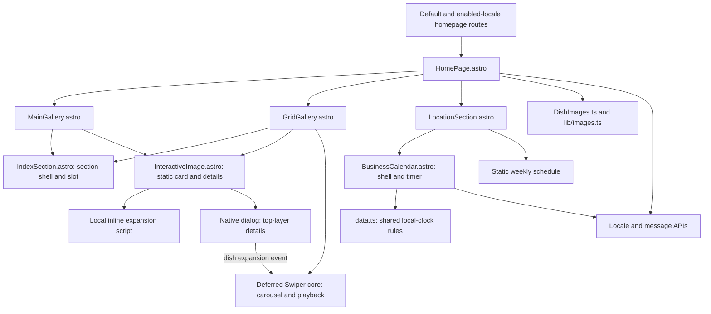
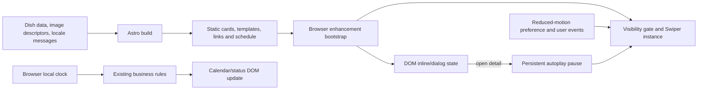

## Context

See `proposal.md` for motivation and scope. The site uses static Astro output, CSS Modules, localized shared homepage components, and five React components. `HomePage.astro` hydrates `MainGallery` and `GridGallery` with `client:visible`; `LocationSection.astro` hydrates `BusinessCalendar` with `client:load`. The other TSX files are descendants of the galleries. No additional application React entry point was found.

Existing native precedents include the menu's `dialog`, Astro component scripts, shared image descriptors, locale/message helpers, and the VM-based Jest checks in `BlogMotion.test.js`. `data.ts` already implements local-clock opening rules and countdowns. Use those rather than inventing a state framework or business-hour model.

`restaurant-site-experience` remains the behavioral contract. The delta in `specs/astro-static-delivery/spec.md` tightens runtime delivery, not restaurant features. Preserve current Google-review and multilingual work. Only `en-US` is currently enabled; do not enable locales as a side effect.

## Goals / Non-Goals

**Goals:** eliminate the five TSX consumers and their React dependency graph; preserve static content and bounded interaction; keep styling and localization contracts; demonstrate a smaller first-party runtime against a fresh baseline.

**Non-Goals:** redesign, route changes, content changes, telemetry changes, review-provider changes, a custom carousel, a generic component-controller framework, or deployment changes. Do not change the visitor-local clock to Tulsa time.

## Decisions

### 1. Astro owns markup; local browser scripts own enhancement

Replace components at the same basenames with `.astro` files. `IndexSection.astro` exposes the current props and a default `<slot />`; `MainGallery.astro` renders existing dish arrays through `InteractiveImage.astro`. Static images, names, badges, descriptions, image dimensions, `srcset`, loading hints, locale attributes, and AI notices remain authored HTML.

Processed Astro scripts initialize every matching instance using scoped `data-*` roots, since a component's script is bundled once even if rendered many times. Serialize only locale identifiers, strings, and small options in escaped attributes or rendered templates; keep rich content in DOM rather than duplicating it in a JSON payload. Do not serialize the current `dishLabel` callback: derive labels during Astro rendering. Keep `getMessage` and the existing locale types.

Alternative: retain React as an island for all interactions. Rejected because every current fragment maps to DOM state, a native modal, time updates, or the installed carousel's imperative API.

### 2. Preserve featured expansion; use native modal gallery details

Keep featured cards' inline expansion, toggle behavior, outside-click dismissal, and scrolling descriptions. Use a native button for activation with `aria-expanded` and `aria-controls`, separate from the description region to avoid invalid button descendants or nested interactive controls. Maintain the present photograph/overlay layout through narrow CSS changes. Escape collapses inline detail without consuming unrelated events.

For grid cards, render a labeled `<dialog>` outside the clipping slide/card container and call `showModal()`. Use the top layer instead of a portal or manual z-index escape. Pre-render each card's dialog content with unique label/control IDs; this avoids a new cross-component data store. Reuse the menu's native-modal interaction pattern without changing menu behavior or extracting a speculative framework.

Opening emits a bubbling, locally scoped dish-expansion event so the containing gallery can stop autoplay; a callback cannot cross the Astro/browser boundary. Close through Close, Escape, or a genuine outside-content backdrop hit. Centralize cleanup on the dialog's `close` event: restore the exact prior body overflow value, expanded state, and focus to the initiating button without scrolling away. Native modality provides focus containment and inert background; explicitly preserve scroll locking.

No-JavaScript users retain dish names, images, links, and essential content; enhancement-only triggers and controls must not appear operational until bound. Keep the existing weekly schedule visible independently.

Alternative: a shared sitewide dialog controller. Rejected because the menu already works and the limited homepage gallery does not justify a new global abstraction.

### 3. Keep Swiper, remove its React wrapper

`GridGallery.astro` emits standard `.swiper`, `.swiper-wrapper`, and `.swiper-slide` markup plus explicit previous/next buttons, localized playback labels, and the existing localized menu link. Import only Swiper core and `A11y`, `Grid`, `Navigation`, `Autoplay`, plus current CSS. Scope navigation elements to each gallery instance.

A small bootstrap observes the gallery and dynamically imports/initializes Swiper once near the viewport, preserving the existing deferred enhancement boundary. If observation is unavailable, initialize directly rather than leaving controls inert. Before initialization, render a usable static two-row-compatible layout or wrapping grid with all dish cards reachable. Swiper CSS must not clip this fallback; switch layout on successful initialization.

Retain `slidesPerView` 1.15/2/3 at default/768/1024px, two rows with `fill: "row"`, spacing 12/15/18px, `slidesPerGroup: 1`, no looping, no centered slides, 4.5-second autoplay, and hover pause. Start autoplay only after reading reduced-motion preference. Focus entering the gallery, navigation, touch/drag, or dish expansion sets the persistent interaction-pause flag. Manual playback can clear that flag when motion is allowed. Reduced motion stops autoplay immediately and disables Play; turning it off only resumes when the persistent pause flag is clear. Use `focusin`/`click` event ordering so keyboard users can explicitly select Play rather than have the same activation immediately cancel it.

Clean up the observer, media-query listener, DOM handlers, and Swiper on page exit. Handle persisted `pagehide`/`pageshow` so a back-forward-cache return reinitializes exactly once. Initialization flags prevent duplicate instances and handlers. Real initialization failures are surfaced, not converted into success; the static fallback remains usable and unbound controls stay unavailable.

Alternative: native scroll snap plus a custom autoplay/navigation implementation. Rejected because matching the existing multirow and touch behavior would create more bespoke logic and risk.

### 4. Calendar updates live values only in the browser

`BusinessCalendar.astro` renders stable structure and locale metadata but not a build-time "open now" value or current-day marker. The existing weekly schedule in `LocationSection.astro` is the no-JavaScript fallback. Bind immediately, evaluate `new Date()` in the visitor's browser, and update at least every 60 seconds using existing helpers.

Render localized weekdays, full date, status, today's hours, countdown singular/plural forms, month cells, today marker, and the current legend. Compute labels through existing message APIs and `Intl`; do not add a translation table. Update calendar cells when the local date/month changes, avoiding wholesale DOM replacement every minute. Preserve inclusive 11:00 opening and exclusive 21:45 weekday/22:00 weekend closing, including rollover at midnight/year boundaries.

Scope interval ownership to the calendar instance, clear it on page exit, and refresh immediately and restart once on a persisted `pageshow`. Do not announce the whole calendar every minute; expose status text accessibly without stealing focus.

Alternative: server-render today's calendar and refresh later. Rejected because static hosting can retain HTML for days and build-time dates would mislead users.

### 5. Remove dependencies only after converting all consumers

Switch shared callers to explicit `.astro` imports and remove their hydration directives. Delete replaced TSX files after checking all imports. Then remove `react()` and its import, uninstall `@astrojs/react`, `react`, `react-dom`, `@types/react`, and `@types/react-dom` with npm so the lockfile stays authoritative. Remove React-specific JSX configuration and obsolete Jest TSX patterns where appropriate without disturbing Astro's inherited configuration or existing tests. Retain Swiper and unrelated dependencies.

Current assessment supports zero exceptions. If a concrete blocker appears, document it with routes, minimum boundary, technical reason, and removal condition in the migration record before retaining the integration/dependencies. State the actual exception in runtime checks and measurements rather than falsely claiming zero React. Mere use of browser state or Swiper is not a blocker.

### Component Architecture

### Data and State Flow

### Detailed Code Change Inventory

All implementation paths are relative to `repos/chengdu`; new test paths are proposed, not existing files.

| File Path | Change Type | Change Description | Affected Module |
| --- | --- | --- | --- |
| `src/components/IndexSection.tsx` -> `IndexSection.astro` | Replace | Props and slot, identical IDs/tone/styles | Section shell |
| `src/components/MainGallery.tsx` -> `MainGallery.astro` | Replace | Build-time featured-card list | Featured dishes |
| `src/components/InteractiveImage.tsx` -> `InteractiveImage.astro` | Replace | Render inline/details markup, native triggers/dialogs, scoped events | Dish interactions |
| `src/components/GridGallery.tsx` -> `GridGallery.astro` | Replace | Static Swiper markup, deferred imperative initialization and playback state | Gallery |
| `src/components/BusinessCalendar.tsx` -> `BusinessCalendar.astro` | Replace | Stable shell, local date render and timer lifecycle | Hours |
| `src/components/HomePage.astro` | Modify | Native imports, remove hydration, resolve labels at render time | Shared localized home |
| `src/components/LocationSection.astro` | Modify | Native calendar import, retain static weekly schedule | Contact section |
| `src/components/Gallery.module.css`, `InteractiveImage.module.css`, `BusinessCalendar.module.css` | Narrow modification | Native button/dialog states, static fallback, preserve proportions and motion rules | Styling |
| `src/components/data.ts`, `DishImages.ts`, `src/lib/images.ts`, `src/lib/i18n.ts`, `src/i18n/*.ts` | Reuse | Preserve source data/helpers; edit only if a conversion needs a tightly scoped type/export | Data and localization |
| `astro.config.mjs`, `package.json`, `package-lock.json`, `tsconfig.json`, `jest.config.ts` | Modify | Remove unused React integration, packages and configuration | Toolchain |
| `src/components/{InteractiveImage,GridGallery,BusinessCalendar}.test.js`, `src/components/data.test.ts` | Add/extend | Follow existing Jest/VM precedent for script and time-state coverage | Behavior checks |
| `tools/check-static-artifacts.js` | Extend | Check native content and absence of React hydration/runtime entries; keep route/review checks | Static contract |
| `docs/react-to-astro-migration.md` | Add | Final assessed-fragment ledger, exceptions or none, reproducible measurements | Migration evidence |
| `README.md`, `PRODUCT.md`, `DESIGN.md` | Modify | Update framework facts and native interaction ownership, no visual redesign | Documentation |
| `.impeccable/design.json` | Conditional companion update | Refresh alongside `DESIGN.md` if its component previews/metadata reference changed markup | Design snapshot |

## Risks / Trade-offs

- [Native markup changes CSS selectors] -> retain CSS Modules and authored aspect ratios; review fallback and enhanced states at mobile, 768px, and 1024px boundaries.
- [Modal sits inside a clipped carousel] -> use `showModal()` top-layer rendering and test focus, backdrop, body overflow restoration, and close at the current slide.
- [Autoplay resumes unexpectedly] -> distinguish reduced motion, persistent user pause, and temporary hover pause; test dynamic preference changes and explicit Play.
- [Time or lifecycle state goes stale] -> browser-local dates, minute refresh, midnight/month/year checks, and single-owner interval handling including back-forward cache.
- [Lazy loading hides the actual runtime cost] -> compare both initial transfer and cumulative transfer after equivalent gallery activation.
- [Historical checks assume only default routes] -> retain current enabled-locale configuration; any checker adjustment must derive enabled routes without expanding multilingual scope.
- [Direct script tests do not prove native focus behavior] -> use existing Jest infrastructure for state logic and a browser pass for native dialog, touch, and focus semantics; do not install a new test framework solely for this migration.
- [Large duplicated dialog HTML] -> the current gallery is bounded to 18 images; report HTML size with JavaScript savings and avoid embedding repeated serialized image payloads.

## Migration Plan

1. Record a fresh current React/Astro baseline with identical content/flags, desktop/mobile captures, initial and post-gallery first-party transfers, artifact totals, and median of three build durations. Existing Gatsby fixtures remain historical comparison only.
2. Convert section/featured/detail components, then the grid using Swiper core, then the live calendar. Keep the integration temporarily while remaining TSX consumers exist.
3. Wire shared callers and remove unused TSX, React packages, and configuration. Add the smallest regression coverage to the current runners.
4. Run targeted Jest checks, typecheck, build and static-artifact checks; inspect keyboard/touch, reduced motion, no-JavaScript fallback and enabled-locale output. Compare the same measurement protocol against baseline and record results.
5. Update contributor/design framework facts and the final exception ledger. A completed zero-exception migration contains no reachable React runtime.

This changes source/build output only, not hosting or publication. If a conversion cannot satisfy existing behavior, retain the affected implementation temporarily with a documented narrow exception rather than removing the behavior. If the native migration is withdrawn, restore its matching component imports, integration, and dependency manifest/lockfile together; do not mix native callers with missing components.
