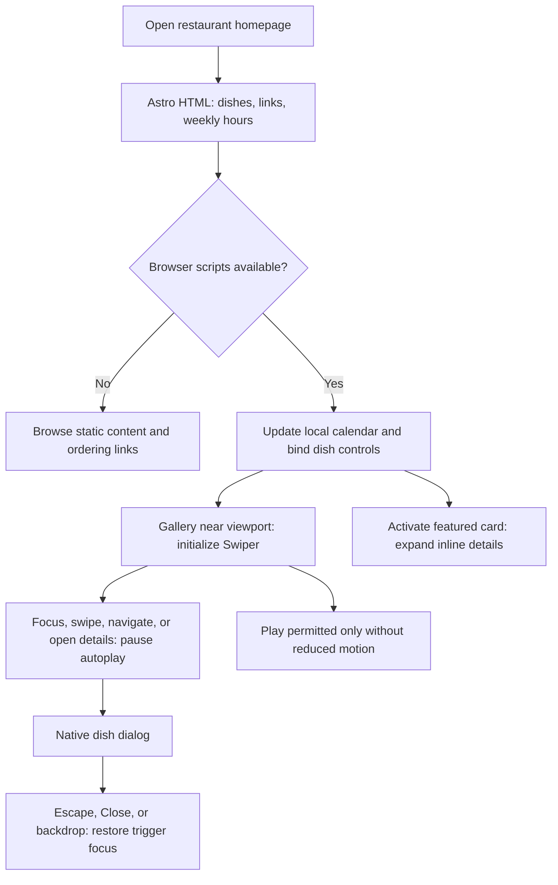

## Why

Chengdu already generates static pages with Astro, but its homepage galleries and business calendar still hydrate React components. Converting these bounded interactions to Astro-rendered HTML and focused browser scripts removes an unnecessary framework runtime while preserving restaurant discovery, dish details, and live opening information.

## Involved Repositories

| Repository Name | Path | Edit Permission | Purpose |
| --- | --- | --- | --- |
| Chengdu | repos/chengdu | [editable] | Current change context |

## What Changes

- Assess all React entry points and their callers; convert the five current TSX components into Astro components, retaining static image and text output.
- Replace featured-card state with a localized DOM enhancement and gallery portals with native modal dialogs.
- Keep the installed Swiper library through its framework-independent API, preserving responsive two-row browsing, touch navigation, controls, and reduced-motion-aware autoplay.
- Replace the calendar island with an Astro shell and a browser-local, minute-refreshed enhancement that reuses existing business-hour helpers.
- Remove React integration, direct runtime/type dependencies, hydration directives, and React-specific configuration once no consumers remain.
- Record the migration inventory, performance comparison, and any genuinely blocked exception with its reason, boundary, and removal strategy. No retained React fragment is currently justified.

### Code Change Map

Paths below are relative to `repos/chengdu`.

| File Path | Change Type | Change Reason | Impact Scope |
| --- | --- | --- | --- |
| `src/components/IndexSection.tsx`, `MainGallery.tsx` | Replace with `.astro` | Render section wrappers and featured cards without hydration | Homepage presentation |
| `src/components/InteractiveImage.tsx` | Replace with `.astro` | DOM-controlled inline expansion and native fullscreen dialog | Featured and gallery dish details |
| `src/components/GridGallery.tsx` | Replace with `.astro` | Initialize framework-independent Swiper on rendered slides | Homepage carousel |
| `src/components/BusinessCalendar.tsx` | Replace with `.astro` | Update browser-local date/status without React | Location and hours |
| `src/components/HomePage.astro`, `LocationSection.astro` | Modify | Import native components and remove `client:*` directives | Default and localized homepages |
| `src/components/{Gallery,InteractiveImage,BusinessCalendar}.module.css` | Modify as needed | Match native markup and preserve fallback layouts | Responsive styling and accessibility |
| `astro.config.mjs`, `package.json`, `package-lock.json`, `tsconfig.json`, `jest.config.ts` | Modify | Remove unused React integration and configuration | Build and dependency graph |
| `src/components/*.test.{js,ts}`, `tools/check-static-artifacts.js` | Add/extend targeted coverage | Guard behavior and framework-free generated output | Regression protection |
| `README.md`, `PRODUCT.md`, `DESIGN.md` | Modify | Describe the actual component/runtime boundary | Contributor guidance |

### Interaction Flow



### Interface Prototype

This is a behavior-preserving migration, not a redesign. The sketch shows existing interaction boundaries; copy, media, colors, section order, and responsive breakpoints remain authoritative in the current source.

```text
+----------------------------------------------------------+
| Featured dishes                                          |
| [Photo / dish name] [Photo / dish name] [Photo / dish name]|
|       activate -> inline description + badges + AI label  |
+----------------------------------------------------------+
| More dishes                                              |
| [Photo] [Photo] [Photo]                                   |
| [Photo] [Photo] [Photo]                                   |
|                 [Previous] [Next]                        |
|                 [Pause / Play] [View Menu]                |
+----------------------------------------------------------+
| Location and hours                                       |
| [Local date / status / next opening] [Contact / map]       |
| [Current-month calendar + legend]                         |
| Weekly schedule remains visible without JavaScript       |
+----------------------------------------------------------+

Gallery detail, rendered above the page:
+--------------------------------------+
| Dish name                    [Close] |
| [Photo] [AI label when applicable]    |
| Feature badges / description         |
+--------------------------------------+
Escape or backdrop closes; focus returns to the dish card.
```

## Capabilities

### New Capabilities

None. This migration does not introduce a new restaurant feature.

### Modified Capabilities

- `astro-static-delivery`: Tighten the client-runtime contract so convertible restaurant surfaces use native Astro output and bounded browser enhancements instead of React, with explicit rules for justified exceptions and a measured comparison against the current React build.

## Impact

The affected implementation is limited to homepage presentation, dish interactions, the live calendar, and associated build configuration. Existing `restaurant-site-experience` requirements remain the behavioral acceptance contract, including keyboard access, no-JavaScript essentials, local-clock business rules, menu links, and static hosting.

Assumptions for this non-interactive run: continue the existing named change; preserve the incumbent UI rather than redesign it; retain Swiper to avoid rewriting a working carousel; target zero React exceptions unless implementation reveals a concrete blocker. Preserve the current `Locale` and message APIs and enabled-locale configuration. Concurrent multilingual and Google-review work is not reimplemented or rolled back. No API, content, ordering destination, analytics policy, deployment workflow, or hosting change is intended.

Capture a fresh pre-migration React/Astro baseline rather than treating historical Gatsby screenshots as current visual authority. Compare first-party JavaScript before and after gallery activation, build duration, artifact size, desktop/mobile rendering, and accessible interaction behavior; report third-party traffic separately without promising an unmeasured speedup.
