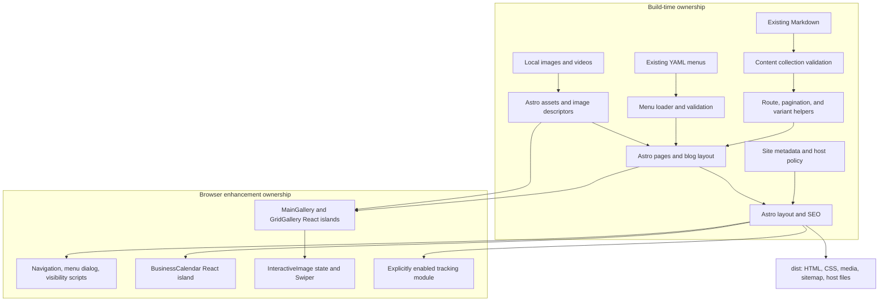
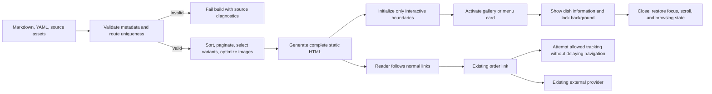

## Context

See `proposal.md` for motivation, repository authority, and the preservation prototype. Implementation paths in this document are relative to `repos/chengdu/`; the planning change lives in the parent workspace.

The inspected application has four file-based pages (`/`, `/menu`, `/menu-mobile`, `/404`), Gatsby-generated `/blog/{page}` listings, and article URLs built from `/blog${frontmatter.slug}`. There are 250 tracked Markdown files, 15 YAML menu groups, local Unicode-named dish images, and responsive WebM videos. Gatsby queries also supply optional article banners and social images.

`Layout.tsx` combines navigation, floating actions, location/calendar, and footer. Gallery and menu interactions depend on React state, image types, and portals; `GridGallery.tsx` already uses Swiper. The only existing application test file is `src/components/data.test.ts`, using Jest/ts-jest. Azure uploads the generated `public/` folder, and IndexNow also reads that folder. `static/` contains source host configuration and the verification file; the ignored `public/` directory is generated output, not a source directory to migrate wholesale.

## Goals / Non-Goals

**Goals:**

- Establish one build-time source for article routes, pagination, validated menus, and image references.
- Keep HTML and CSS authoritative for presentation; isolate browser state instead of retaining a page-wide React shell.
- Preserve source content and asset names, reuse existing styles and business rules, and make `dist/` the only generated output.
- Make route/content/visual equivalence and lower initial first-party JavaScript measurable against the incumbent build.

**Non-Goals:**

- No SPA router, view-transition navigation, server adapter, CMS, search engine, tag archives, translated routes, or content rewrite.
- No timezone-rule change, ordering-provider change, new data layer, generic component framework, or wholesale CSS redesign.
- No publishing or release execution during implementation; only build and host configuration changes.

## Decisions

### 1. Static Astro with selective React reuse

Use a stable Astro release compatible with Node.js 22, `output: "static"`, `site: "https://www.chengdufoodtulsa.com"`, `outDir: "./dist"`, and `trailingSlash: "always"`. Retain compatibility with existing slashless links through static directory routes and host redirects. Add `@astrojs/react` only for the existing complex interactive components, and `@astrojs/sitemap` for crawlable output.

Astro owns the layout, pages, headings, prose, metadata, links, restaurant sections, menu markup, and video markup. Adapt `MainGallery.tsx`, `GridGallery.tsx`, `InteractiveImage.tsx`, and `BusinessCalendar.tsx` rather than rewrite their business behavior. Gallery islands use `client:visible`; live-hour islands use `client:load`. Do not use `client:only` or hydrate `Layout`/whole pages.

Native scoped scripts own mobile navigation, scroll-based navigation visibility, floating-action visibility, menu viewport forwarding, category scrollspy, address-tooltip enhancement, and the menu drawer. A styled native `<dialog>` provides Escape handling and modal focus semantics; explicitly restore trigger focus and body overflow after closing.

**Alternatives:** Keeping all pages in React would retain the hydration cost this change targets. Rewriting all galleries and Swiper state in native JavaScript increases parity risk without a demonstrated benefit. An SSR adapter is unnecessary for static sources.

### 2. Validated content and explicit public route ownership

Use Astro's content collection API with a glob loader over existing `src/content/**/*.md`, not a copied content tree. Validate the original frontmatter contract: a nonempty title and leading-slash public slug, a valid date, opening text for existing variants, and optional dish/banner fields. Use the frontmatter slug to define the entry's public identity, rather than Astro's filename-derived default. Do not generate article paths from Chinese filenames.

`src/lib/content.ts` owns a small set of shared functions: public article-path construction, date-descending sorting with a slug tie-breaker, 12-item pagination, and slug-prefix variant selection. Preserve every existing public slug. Reject duplicate routes, invalid/traversing slugs, and numbered listing collisions before static path generation. Dates are parsed as date-only values for ordering and formatted consistently as English month/day/year; use an ISO date for `<time datetime>` rather than a human-formatted string.

Use separate routes to prevent ambiguity:

| Public URL | Astro source | Ownership |
| --- | --- | --- |
| `/` | `src/pages/index.astro` | Home presentation |
| `/menu/` | `src/pages/menu.astro` | Desktop menu |
| `/menu-mobile/` | `src/pages/menu-mobile.astro` | Mobile menu and drawer |
| `/blog/` | Astro redirects configuration | Static redirect to `/blog/1/` |
| `/blog/{page}/` | `src/pages/blog/[page].astro` | Numeric listing paths |
| `/blog/{article-slug}/` | `src/pages/blog/[...slug].astro` | Article paths from frontmatter |
| Unknown routes | `src/pages/404.astro` | Generated `404.html` |

`getStaticPaths()` precomputes lists/articles. Static single-segment listing routes take precedence over the rest route, but conflicting source slugs still fail validation rather than disappear. With no eligible articles, generate `/blog/1/` with an empty message and no pagination. Preserve the five-number pagination window and ellipses.

`src/layouts/BlogPost.astro` reproduces the six established prefix-specific introductory/concluding variants plus the generic fallback. Render Markdown through Astro and reuse the existing disclaimer/warning and ordering controls; do not re-author article content.

**Alternatives:** Loading Markdown in the browser breaks static/no-script content and SEO. A catch-all containing both listings and articles obscures route collisions. MDX is not needed: the inspected tracked content is Markdown, with no MDX files.

### 3. Keep YAML menus and map images at build time

`src/lib/menus.ts` imports `menus/menu-*.yml` as raw build-time inputs, parses with a declared YAML dependency, validates group/item/feature fields, sorts groups by prefix, and retains original item order and bilingual data. Do not rely on an undeclared Gatsby-transitive parser dependency. Duplicate group prefixes or dish codes and malformed fields fail with source-file diagnostics.

Both menu routes share an Astro `MenuContent` component with a layout mode and reuse existing CSS modules. Keep the 768px breakpoint and route distinction. The viewport forwarding script only redirects when the current route is mismatched and preserves the selected category fragment. Use CSS media queries for presentation and `100dvh` for the mobile viewport rather than creating a whole React page to calculate height.

Render all categories/cards as HTML with ordinary fragment links. Progressive category scripts update the active indicator inside the correct scroll container; links remain functional without JavaScript. Mobile image-backed cards open `DishDetailDrawer.astro` with server-rendered detail data. Retain code/name placeholders for unmatched image references instead of hiding dishes.

**Alternatives:** Converting YAML to JSON or changing item keys creates unnecessary editorial churn. A React island covering the entire menu duplicates large serialized menu data and needlessly hydrates static cards.

### 4. Astro image processing and source static assets

Use `astro:assets` and a scoped `import.meta.glob` image registry in `src/lib/images.ts`. Astro components render optimized images; React islands receive serializable image descriptors (`src`, `srcSet`, `sizes`, width, height, alt), not Gatsby image data or Astro component objects. Build these descriptors with Astro's `getImage()` at build time.

Retain gallery image ordering from `DishImages.ts` and the existing 18-image gallery limit. Preserve approximately 400x300 menu/thumbnail cropping, 600px featured sources, and 800x400 article banners with a separate 1200x630 social image when applicable. Reuse existing eager/lazy loading intent and preserve dimensions to avoid layout shifts. Unicode names resolve through imported assets; avoid constructing unescaped source-file URLs.

Keep video files in `src/images/v/` and import their generated URLs. Preserve 480p below 768px and 720p otherwise, muted/loop/playsinline behavior, with a scoped media-query enhancement. Native video rendering and a stable hero background retain the experience when autoplay is blocked. Honor reduced-motion preferences for autoplay and smooth scrolling without removing controls or content.

Move only authored `static/*` files into the new Astro `public/`. Do not copy Gatsby's generated output. Generate manifest/icon assets from the existing `src/images/icon.jpeg` with a minimal build-time asset step, including the referenced `/icons/icon-512x512.png` fallback; confirm actual URLs rather than copying transient plugin output. Add a source `public/robots.txt` referencing `/sitemap-index.xml`.

**Alternatives:** Serving every original image unoptimized risks a performance regression. Migrating Gatsby's generated image directory retains obsolete outputs and breaks reproducibility.

### 5. Preserve styling and shared shell without browser-wide state

`src/layouts/Layout.astro` retains existing visibility props for navigation, location, footer, and floating actions. Existing CSS modules and global styles are the visual authority: red/gold palettes, Merriweather prose, Playfair headings, and display/hero fonts remain. Import Vite CSS modules using their supported export shape and preserve selectors/classes when porting markup.

Keep Tailwind v4/PostCSS where current utility classes and `@apply` require it; replace only the Gatsby plugin wiring. Load current fonts with native preconnect/stylesheet links and `display=swap` instead of a font-loader runtime.

Use normal `<a>` links in place of Gatsby `Link`/`navigate`, with page-context-aware `#location` versus `/#location`. Mobile navigation exposes the same items and calendar, closes on selection/backdrop/Escape, and manages focus and scroll locking. Hero floating actions follow hero visibility via an observer; static fallback leaves order links usable.

The business-hour island reuses `data.ts` and its tests. Render weekly hours and a deterministic neutral initial state on the server; resolve the current calendar/day/status in the browser, then refresh each minute. Share this presentation between location and mobile navigation without hardcoding build-day status.

**Alternatives:** Replacing CSS/Tailwind or changing the visual identity increases migration scope. Computing "Open Now" only during generation makes the result stale as soon as time advances.

### 6. Explicit browser-only analytics and native metadata

`src/components/SEO.astro` renders the existing title suffix, page descriptions, keyword metadata, canonical and social links, and language directly in `<head>`. Resolve relative or absolute image references against the production origin. Preserve social image meaning while using valid card metadata. Generate sitemap indexes through the sitemap integration, excluding redirect-only and not-found URLs.

Adapt `clarity.ts` to a browser-only, explicitly initialized tracking module. Use `PUBLIC_ENABLE_ANALYTICS=true` plus the production build mode; the release build configuration maps the existing main-branch intent to this flag. The explicit flag defaults off for local builds and pull-request previews. This is an intentional correction to current unconditional Clarity initialization, not a requirement to enable analytics everywhere.

Keep existing Clarity project ID, Google identifiers, conversion destination, and exact event strings (`DeliveryButton_Click`, `PickUpButton_Click`, `MenuButton_Click`, `FindLocationButton_Click`). Mark ordinary links with event data attributes; one shared browser handler dispatches tracking without `preventDefault`. Retain Google DNT and excluded-path behavior. Blocking or failing telemetry must never block ordering, and no browser SDK runs during static generation.

**Alternatives:** Importing analytics into server-rendered action components can execute browser SDK code during builds. Retaining Gatsby's tracking plugin is incompatible with removing Gatsby.

### 7. One artifact directory and compatible repository commands

Keep npm and Node.js 22, select mutually compatible stable Astro/integration versions, and regenerate `package-lock.json`. Replace `dev`/`start` with `astro dev`, `build` with `astro build` plus only necessary asset steps, and `serve` with `astro preview`. Add `preview` as an alias if useful. Retain a narrowly scoped `clean` command for `dist/` and `.astro/` only; never remove source `public/`.

Use `astro check` with the required `@astrojs/check` dependency for `.astro` diagnostics and retain `tsc --noEmit` coverage for non-Astro TypeScript. Keep Jest/ts-jest for current business-rule and new pure-function tests. Preserve CommonJS compatibility for `scripts/indexnow.js` and Jest configuration rather than adding `"type": "module"` indiscriminately.

Remove all Gatsby dependencies/plugins, Gatsby-specific type declarations, and obsolete MDX/Helmet dependencies after their imports are gone. Keep React, ReactDOM, Swiper, and Clarity only where the selected islands/tracking still use them. Ignore `dist/` and `.astro/`; stop ignoring authored `public/`.

Update test workflow path filters and build/typecheck coverage. Update release configuration's build-size paths and Azure upload source to `/dist`, setting `skip_app_build: true` because the artifact is already built. Preserve existing secrets references and PR lifecycle behavior; do not run an upload.

In `public/staticwebapp.config.json`, point the 404 response override at `/404.html`, add an explicit `/blog` to `/blog/1/` redirect, and avoid an SPA fallback. Astro's redirect HTML supplies local-preview compatibility while Azure supplies the host redirect. Point IndexNow at `dist/` and read child sitemap URL entries, not the sitemap index's child XML locations.

**Alternatives:** Configuring Astro output as `public/` conflicts with Astro's source public directory. Letting Azure rebuild an already built artifact is redundant and can choose a different toolchain.

### Component and Module Architecture

### Content and Interaction Data Flow

### Detailed Code Change Inventory

| File Path | Change Type | Change Description | Affected Module |
| --- | --- | --- | --- |
| `astro.config.mjs` | Add | Static/site/redirect/react/sitemap configuration | Build and routes |
| `package.json`, `package-lock.json`, `tsconfig.json` | Modify | Dependency replacement, supported commands, Astro types/checks | Toolchain |
| `src/env.d.ts`, `src/declarations.d.ts` | Add/adapt | Astro/Vite environment and media types; remove Gatsby-only declarations | Type safety |
| `src/content.config.ts`, `src/lib/content.ts` | Add | Validated collection, slug/variant/sort/pagination helpers | Publishing |
| `src/lib/menus.ts`, `src/lib/images.ts` | Add | Typed YAML loading and shared asset resolution | Source data |
| `src/pages/index.tsx` -> `src/pages/index.astro` | Replace | Static home sections and isolated gallery behavior | Home |
| `src/pages/menu.tsx`, `src/pages/menu-mobile.tsx` -> `.astro` equivalents | Replace | Shared static menu markup, viewport behavior and category script | Menus |
| `src/components/MenuContent.astro`, `src/components/DishDetailDrawer.astro` | Add/replace | Menu cards and accessible native drawer | Menu interaction |
| `src/templates/blog-list.tsx` -> `src/pages/blog/[page].astro` | Replace | Static pagination, existing list CSS and metadata | Blog lists |
| `src/templates/blog-post.tsx` -> `src/pages/blog/[...slug].astro`, `src/layouts/BlogPost.astro` | Replace | Article rendering and existing content-specific sections | Articles |
| `src/pages/404.tsx` -> `src/pages/404.astro` | Replace | Branded `404.html` and recovery actions | Error routes |
| `src/components/Layout.tsx` -> `src/layouts/Layout.astro`, `src/components/seo.tsx` -> `src/components/SEO.astro` | Replace | Static document/shell, props and head tags | Shared presentation |
| `src/components/TopNavigation*`, `DesktopNavigation*`, `MobileNavigation*`, `FloatingActionButtons*` | Port/adapt | Static links plus focused browser scripts and CSS | Navigation |
| `src/components/DeliveryButton*`, `PickupButton*`, `MenuButton*`, `FindLocationButton*`, `DishMenuLink*` | Port/adapt | Normal anchors and declarative event markers | Actions |
| `src/components/BackgroundVideo*`, `IndexSection*`, `RestaurantFeatures*`, `LocationSection*`, `Footer*` | Port/adapt | Static markup, existing copy/CSS and media | Restaurant sections |
| `src/components/MainGallery.tsx`, `GridGallery.tsx`, `InteractiveImage.tsx` | Modify | Serialize optimized images, preserve interactions and lazy hydration | Galleries |
| `src/components/BusinessCalendar.tsx`, `data.ts`, `data.test.ts` | Adapt/preserve | Stable server fallback, live minute updates; retain rule semantics/tests | Business hours |
| `src/components/clarity.ts`, `src/lib/site.ts` | Modify/add | Browser-safe events, explicit production flag, shared site metadata | Tracking and metadata |
| `src/styles/*`, `src/pages/*.module.css`, `src/templates/*.module.css`, `src/components/*.module.css`, `postcss.config.js`, `tailwind.config.js` | Reuse/adapt | Preserve visual identity and repair framework wiring/selectors only | Styles |
| `static/*` -> `public/*`, `public/robots.txt`, `public/manifest.webmanifest`, generated icon files, icon asset step | Move/add | Authored host files and reproducible plugin replacements | Public assets |
| `.github/workflows/test.yml`, `.github/workflows/release.yml`, `scripts/indexnow.js` | Modify | Test coverage/filters and correct `dist/` consumers | Build configuration |
| `jest.config.ts`, focused `src/lib/*.test.ts`, `scripts/check-static-site.js` | Adapt/add | Existing Jest checks plus built-artifact regression check | Validation |
| `README.md`, `docs/how-to-post.md`, `.gitignore` | Modify | Astro setup/authoring, output/source distinction | Contributor workflow |
| `gatsby-config.ts`, `gatsby-node.ts`, `gatsby-browser.tsx`, `src/gatsby-types.d.ts` | Remove last | Eliminate retired framework entry points and generated types | Cleanup |
| `src/content/*.md`, `menus/*.yml`, `i18n/*`, `src/images/*`, `tools/*`, unrelated image workflows | Preserve | Inputs and unrelated utilities are not rewritten | Scope boundary |

## Risks / Trade-offs

- [Many posts share dates, so Gatsby's tie order may be incidental] -> Capture the baseline order; preserve chronological behavior and use the documented slug tie-breaker for deterministic builds, with all posts accounted for.
- [CSS expects Gatsby image wrappers, named exports, and nested React markup] -> Adapt wrappers/selector use deliberately, then compare desktop/mobile captures together against the incumbent.
- [Deferred Swiper hydration can leave a blank or unstable gallery] -> Server-render a usable gallery structure with reserved image dimensions; hydrate only its interaction boundary and confirm no-script rendering.
- [Reactive time/calendar values can mismatch server output] -> Use a deterministic initial fallback and populate current-time state only after mounting.
- [Public output could accidentally become Astro input] -> Migrate only tracked `static/` files and generated icon replacements; never copy the ignored Gatsby output tree.
- [Azure and local preview differ on redirect/404 handling] -> Provide both generated static redirect output and explicit host policy; inspect host configuration and preview deep links separately.
- [Telemetry privacy gating changes current Clarity behavior] -> Document the intentional production-only change and cover enabled/disabled/DNT/blocked tracking without testing live submissions.
- [First-party JS or image work may still be excessive] -> Measure cold-load initial bytes per representative route, excluding third parties; narrow hydration before changing visual features.
- [Dependency engines vary across stable Astro releases] -> Resolve compatible versions and a supported Node 22 patch during toolchain setup, without speculative package upgrades.

## Migration Plan

1. Capture the existing route/content/menu inventories, representative HTML/metadata, desktop/mobile screenshots, and cold-cache first-party JavaScript baseline before removing Gatsby.
2. Establish the Astro toolchain alongside the current source, then implement shared loaders/assets/layout and static routes. Keep originals available until replacement surfaces are complete.
3. Port localized interactions and tracking, then align static asset/host configuration, CI artifact consumers, and documentation.
4. Remove retired Gatsby dependencies/configuration only after no active imports depend on them. Build from the updated lockfile and complete the validation gates below.
5. Hand off the verified static artifact and configuration for the existing publication workflow. No deploy/upload operation is an implementation task.

Rollback boundary: keep the last working Gatsby site/artifact available during migration. If route, content, interaction, or host compatibility gates fail, do not replace the published site; the existing site remains authoritative. A publication operator can restore that prior artifact/configuration if a subsequent rollout fails. No new rollout infrastructure is required.

### Validation Gates

- Reuse Jest for business-hour rules and add focused pure-function cases for slug collisions, variant selection, invalid metadata, menu parsing, deterministic ordering, and pagination at 0/1/12/13/250 articles.
- Run `npm run typecheck`, targeted Jest cases, and `npm run build`; ensure Astro files are actually checked, not only legacy TypeScript.
- Add `scripts/check-static-site.js` using Node built-ins to compare the captured route inventory with generated files, verify all article/listing counts, sample each variant, and check internal links, images, canonical/social metadata, host files, sitemap URLs, and absence of Gatsby outputs.
- Run local preview and request `/`, both menus, `/blog`, first/last lists, representative articles from all variants, Unicode-backed images, video, and not-found HTML. Local preview is not proof of Azure status codes; verify those through the explicit host policy as well.
- Inspect desktop/mobile navigation, menu scrollspy/drawer, gallery controls/autoplay/fullscreen, live hours, blocked analytics, reduced motion, keyboard/focus behavior, and no-script essential content. Batch incumbent/migrated screenshots for the representative pages; resolve migration regressions without redesigning.
- Compare initial first-party JavaScript bytes under matching conditions for home/menu/article. If a baseline cannot be produced, record that blocker and do not claim a demonstrated reduction; successful rendering alone is not the performance gate.
