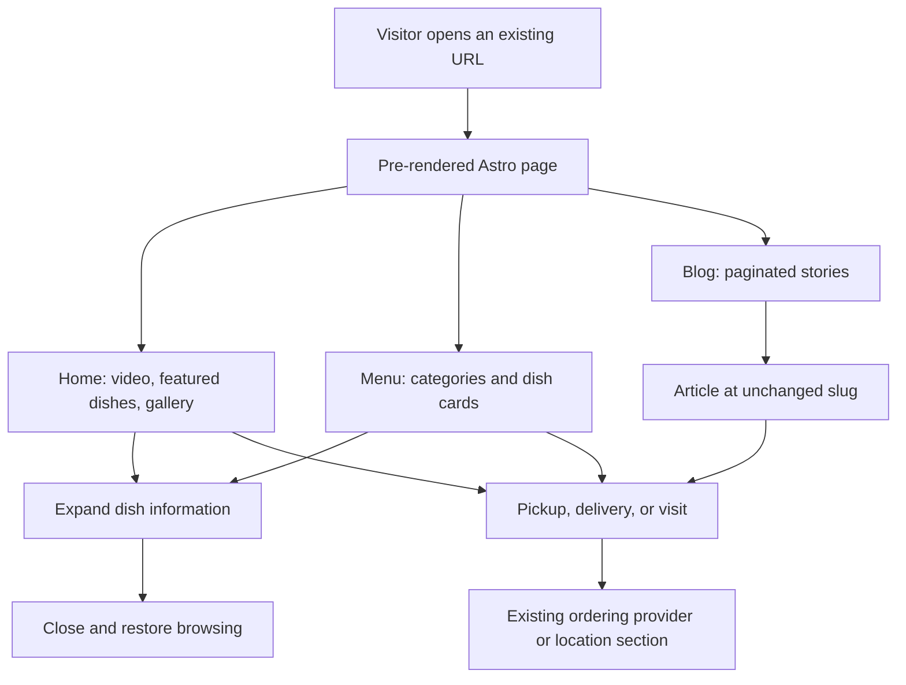

## Why

Chengdu's content-focused restaurant website currently depends on Gatsby's GraphQL pipeline, image plugins, and page-wide React runtime. Moving to Astro static generation will simplify the toolchain and reduce framework JavaScript while preserving the restaurant experience, published URLs, and article content.

## What Changes

- **BREAKING (developer tooling):** Replace Gatsby development, build, and preview commands with Astro equivalents; generated output moves from `public/` to `dist/`.
- Generate existing home, desktop menu, mobile menu, blog listing, article, and not-found routes as static HTML. Keep `/blog` forwarding to `/blog/1` and preserve article frontmatter slugs.
- Replace Gatsby queries with validated Markdown content collections and build-time YAML loading. Preserve date-descending blog ordering, 12 articles per page, menu group ordering, and existing content-specific article sections.
- Render presentation and shared page structure in Astro; use narrowly scoped scripts or React islands for navigation, galleries, dish dialogs, and live business hours. Do not hydrate entire pages.
- Preserve the incumbent red/gold identity, typography, imagery, video, responsive layouts, restaurant details, menu notices, AI disclosures, and pickup/delivery destinations.
- Replace plugin-provided metadata, fonts, icons/manifest, sitemap, robots, and analytics integrations. Preserve tracking identifiers/events and Google tracking's DNT/path exclusions; explicitly gate analytics to production so development and previews do not send events.
- Update source asset handling, Azure static-host configuration, build configuration, IndexNow's artifact reader, and local authoring documentation without performing a deployment.

## Capabilities

### New Capabilities

These are newly documented acceptance contracts for existing functionality and the new delivery model, not proposals for new customer-facing features.

- `restaurant-site-experience`: Preserve the home page, responsive menus, navigation, galleries, ordering, location, live hours, and usable interaction states.
- `static-content-publishing`: Preserve article routes, Markdown rendering, pagination, content variants, and SEO/static asset outputs.
- `astro-static-delivery`: Provide Astro-only static builds, localized client interactivity, reproducible commands, and compatible build/host configuration.

### Modified Capabilities

None. No existing specifications were found under `openspec/specs/`.

## Involved Repositories

| Repository Name | Path | Edit Permission | Purpose |
| --- | --- | --- | --- |
| Chengdu | repos/chengdu | [editable] | Current change context |

## Impact

All implementation paths below are relative to `repos/chengdu/`. Only planning artifacts are created during this stage.

| File Path | Change Type | Change Reason | Impact Scope |
| --- | --- | --- | --- |
| `package.json`, `package-lock.json`, `tsconfig.json`, `astro.config.mjs` | Modify/add | Replace Gatsby with an Astro static toolchain | Development and build |
| `gatsby-config.ts`, `gatsby-node.ts`, `gatsby-browser.tsx`, `src/gatsby-types.d.ts` | Remove after migration | Retire plugin configuration, queries, and generated Gatsby types | Framework coupling |
| `src/pages/*`, `src/templates/blog-*.tsx` | Replace | Implement equivalent Astro routes and blog templates | Published URLs and page rendering |
| `src/layouts/*`, `src/components/*`, `src/styles/*`, `postcss.config.js` | Add/adapt | Separate static presentation from interactive behavior; retain CSS identity | Shared shell and responsive UI |
| `src/content.config.ts`, `src/lib/*`, `src/content/*.md`, `menus/*.yml`, `src/images/*` | Add loaders; preserve content/assets | Load and validate existing inputs without GraphQL | Articles, menus, media |
| `static/*` to `public/*`, `.gitignore` | Move/modify | Make `public/` source assets rather than generated Gatsby output | Static host files and icons |
| `.github/workflows/test.yml`, `.github/workflows/release.yml`, `scripts/indexnow.js` | Modify | Consume Astro configuration and `dist/` output | CI and artifact consumers |
| `jest.config.ts`, `src/components/data.test.ts`, new focused tests, `README.md`, `docs/how-to-post.md` | Adapt/add | Keep business rules covered and document Astro authoring/preview | Regression protection and maintenance |

### Interaction Flow



### Preservation Prototype

This is a structural sketch, not a redesign; current CSS and assets remain the visual authority.

```text
DESKTOP HOME
+-------------------------------------------------------------------+
| Chengdu in Tulsa | Home | Full Menu | Delivery | Pickup | Blogs     |
+-------------------------------------------------------------------+
|                 Restaurant video / Chengdu title                  |
|              [Get Delivery] [Get Pickup] [Full Menu]               |
+-------------------------------------------------------------------+
| Featured Dishes: [image + name] [image + name] [image + name]        |
| Restaurant features                                               |
| Gallery: [previous] [dish grid; open details] [next]                |
| About Chengdu                                                     |
| Visit Us: [hours + current calendar] [contact + map]                |
| Footer                                    [floating order actions]|
+-------------------------------------------------------------------+

MOBILE MENU                              DISH DETAIL STATE
+----------------------------------+     +--------------------------+
| Chengdu in Tulsa       [Menu]    |     | Dish name          [Close]|
| Menu update / image notice      |     | [dish image]             |
| A | Appetizers & Cold Dishes     | --> | Feature badges           |
| B | [dish] [dish]               |     | Description              |
| C | [dish] [dish]               |     +--------------------------+
|...| [scrollable dish groups]    |     Close -> previous card focus
| [Get Delivery] [Get Pickup]     |
+----------------------------------+
```

### Assumptions and Boundaries

- Continue the already scaffolded `migrate-gatsby-to-astro` change in non-interactive mode. Preserve the current visual system rather than introduce a redesign.
- Keep Node.js 22 and npm unless the selected stable Astro release requires a compatible newer Node 22 patch.
- Search was explicitly removed from `src/pages/menu.tsx`; tag archive routes and active multilingual routing are not implemented. Do not invent search, tag filtering, translations, or a CMS. Preserve dish feature badges and all existing bilingual source data.
- Business-hour calculations currently use the visitor's local clock; preserve that contract and minute refresh, rather than silently change timezone semantics.
- No server runtime, new API, live publishing, actual deployment, or broad unrelated cleanup is included.
